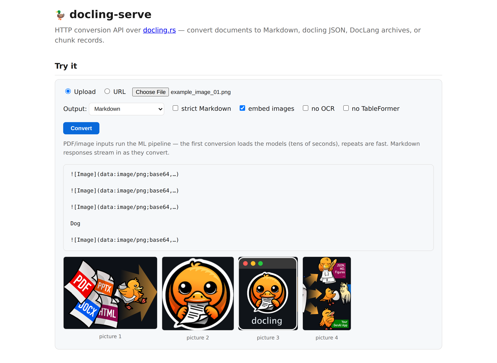

# docling.rs

<p align="center">
  
</p>

A Rust port of [docling](https://github.com/docling-project/docling): convert
documents into a unified `DoclingDocument` for downstream AI workflows.

The format migration is **complete** — every document format in docling's
pipeline is supported, validated byte-for-byte against live docling. See
[`docs/MIGRATION.md`](./docs/MIGRATION.md) for the full architecture, the Python → Rust
mapping, and per-format conformance.

## Status

The public API works end to end across **Markdown, CSV, HTML, AsciiDoc, DOCX,
PPTX, XLSX, EPUB, ODF, WebVTT, Email, MHTML, JATS, USPTO, XBRL, LaTeX, JSON,
PDF, images, METS and audio** — plus Markdown / docling-JSON output and image
extraction. MHTML is a docling.rs-only extension (docling has no MHTML
backend): saved-webpage `.mhtml`/`.mht` archives are parsed as a MIME message
with [`mail-parser`](https://crates.io/crates/mail-parser) (which conforms to
[RFC 2557](https://datatracker.ietf.org/doc/html/rfc2557), the MHTML spec) and
routed through the HTML backend, with embedded images resolved from the
archive by `Content-Location`/`cid:`. The discriminative PDF/image pipeline
lives in `docling-pdf`: a pure-Rust PDF text parser, pdfium for page
rasterization, and an ONNX layout/TableFormer/OCR stack. TableFormer is ported
to ONNX and run on every detected table region to recover its structure;
geometric reconstruction from cell positions remains only as the fallback when
the TableFormer graphs aren't present (see `docs/PDF_CONFORMANCE.md`).

**Audio/ASR** (docling's Whisper pipeline) lives in `docling-asr`, and it is
Rust all the way down: [`symphonia`](https://crates.io/crates/symphonia)
demuxes/decodes the container in-process (wav, mp3, flac, ogg, aac, m4a — plus
the audio track of mp4/mov; no ffmpeg), a ported log-mel front-end feeds a
**Whisper tiny** encoder/decoder exported to ONNX (run on `ort`, greedy with
OpenAI's timestamp rules — docling's ASR defaults), and each segment becomes a
`[time: start-end] text` paragraph. `DOCLING_RS_ASR_LANG` picks the language
(default `en`). AVI is the one container symphonia cannot demux.

Output is checked against upstream Python docling — declarative formats
byte-for-byte against live docling, the ML pipeline against a deterministic
snapshot baseline. See [`docs/MIGRATION.md`](./docs/MIGRATION.md) and
`scripts/conformance/conformance.sh`.

## RAG subsystem

[`crates/docling-rag`](./crates/docling-rag) builds a pluggable
Retrieval-Augmented-Generation layer on top of the converter: it turns documents
into Markdown, chunks them (streaming sliding window, or docling's
hierarchical/hybrid chunkers via `RAG_CHUNKER`), embeds the chunks, and
stores them in a vector database for semantic search. Every external dependency is
a swappable trait — embedders (**Ollama**/Gemini/local-ONNX), vector stores
(**SQLite+sqlite-vec**/PostgreSQL+pgvector), LLM (**OpenRouter**, DeepSeek-V3 by default),
document sources (**folder**/FTP/SFTP), and message queues
(**in-process**/RabbitMQ/Redis). It ships Hybrid, Multi-Query fusion and HyDE
retrieval plus an evaluation harness to compare configurations and an
API-key-protected REST API (`docling-rag serve`) for document info and
search. Configure it via [`.env`](./.env.example); see the
[crate README](./crates/docling-rag/README.md) for a quickstart on any
documents folder.

## HTTP conversion API — `docling-rs serve`

[`crates/docling-serve`](./crates/docling-serve) is the analogue of Python's
`docling-serve`: a long-running server exposing the converter over HTTP. One
warm PDF/image pipeline (layout/OCR/TableFormer stay loaded) is shared across
requests, so repeat PDF conversions skip the model load (~13× faster than a
cold call on the test fixtures); a semaphore bounds concurrent conversions.
Markdown responses stream (chunked transfer); `/health` + `/ready` suit
container probes, and SIGTERM drains in-flight requests before exit.
`GET /` serves API docs plus an interactive test form — upload or URL in,
streamed result out, with extracted pictures rendered below the text:

<p align="center">
  
</p>

```bash
cargo run --release -p docling-serve                 # 127.0.0.1:5001
# or: cargo run --release -p docling-cli --features serve -- serve

curl -F file=@paper.pdf localhost:5001/v1/convert                # Markdown
curl -F file=@report.docx 'localhost:5001/v1/convert?to=json'    # docling JSON
curl -F file=@sheet.xlsx  'localhost:5001/v1/convert?to=dclx' -O # DocLang archive
curl -F file=@page.html   'localhost:5001/v1/convert?to=chunks'  # chunk records
curl -H 'content-type: application/json' \
     -d '{"url": "https://example.com/doc.pdf", "to": "md"}' \
     localhost:5001/v1/convert                                   # fetch a URL
```

Options per request: `to=md|json|dclx|chunks`, `strict`, `images=placeholder|embedded`,
`no_ocr`, `no_table_former`, `fetch_images` — as query parameters, multipart
fields, or JSON keys (body wins). Server flags: `--addr`, `--concurrency`,
`--max-body-mb`, `--warmup`, `--no-url-fetch`, `--strict`. A container image
builds from [`crates/docling-serve/Dockerfile`](./crates/docling-serve/Dockerfile)
(models + pdfium baked in, or mounted with `--build-arg FETCH_ASSETS=0`).
URL inputs make the server fetch outbound (SSRF surface): it binds loopback by
default — front it with a policy proxy or pass `--no-url-fetch`.

## In the browser — `docling-wasm`

The declarative converters (everything except the PDF/image/audio ML
pipelines) compile to `wasm32-unknown-unknown`:
[`crates/docling-wasm`](./crates/docling-wasm) exposes
`convert(bytes, filename, to)` → Markdown / docling JSON / DocLang via
`wasm-bindgen`, so DOCX/HTML/XLSX/PPTX/EPUB/… convert **fully client-side** —
no server, ~1.9 MB gzipped module, no models to download — something Python
docling has no equivalent for. Digital PDFs convert too: the opt-in
`pdf-text` feature runs docling-pdf's pure-Rust text-layer parser (the same
extraction as `--no-ocr`: flat paragraphs, no headings/tables/pictures),
while scanned PDFs get a clear "needs OCR" error instead of an empty
document. The crate ships a drop-a-file demo page under
[`www/`](./crates/docling-wasm/www). Native builds are untouched: the
feature slices behind this (`pdf` / `asr` / `fetch-images`) all stay in the
`docling` default set, so a plain `cargo build` is unchanged.

## The API

```rust
use docling::{DocumentConverter, SourceDocument};

let converter = DocumentConverter::new();
let result = converter
    .convert(SourceDocument::from_file("input.md").unwrap())
    .unwrap();

println!("{}", result.document.export_to_markdown()); // Markdown
println!("{}", result.document.export_to_json());     // docling DoclingDocument JSON
```

### JSON output

`export_to_json()` emits docling-core's native `DoclingDocument` wire format
(schema `1.10.0`) — the same shape Python docling's `export_to_dict()` /
`save_as_json()` produce: a `body` tree of `$ref`s into `texts` / `groups` /
`tables` / `pictures`, with labels (`title`, `section_header`, `list_item`,
`code`, `formula`, …), list grouping, and table grids. The output loads straight
back into Python docling-core (`DoclingDocument.load_from_json(...)`) and
round-trips to the same Markdown.

> Note: docling.rs's model bakes inline formatting (bold, links, inline math)
> into the text, so for those spans the JSON carries the rendered text rather
> than docling's structured `formatting` / `hyperlink` fields. Block structure,
> headings, lists, tables, code and display equations match.

### DocLang (`.dclx`) output

`export_to_doclang()` renders the document as **DocLang** — docling 2.110's
XML serialization (`<doclang version="0.7">`) of the `DoclingDocument` tree:
headings, paragraphs, rich inline runs (`<bold>` / `<italic>` / `<underline>` /
`<strikethrough>` / `<subscript>` / `<superscript>`), lists with enumeration
`<marker>`s, tables with per-cell `<location>` provenance, code blocks with a
language `<label>`, formulas, pictures and furniture. The pretty-printed
indentation follows Python's `minidom.toprettyxml` byte-for-byte.

```rust
println!("{}", result.document.export_to_doclang()); // <doclang> XML string
```

Wrap that XML in an OPC archive — the `.dclx` container docling's
`save_as_doclang()` writes (`[Content_Types].xml` + `_rels/.rels` +
`document.xml`) — with `docling::dclx::save_as_dclx`:

```rust
use std::path::Path;
docling::dclx::save_as_dclx(&result.document, Path::new("out.dclx")).unwrap();
```

From the CLI, `--to dclx` writes `<input-stem>.dclx` next to the CWD:

```sh
cargo run -p docling-cli -- --to dclx crates/docling/sample.html   # -> sample.dclx
```

Conformance against docling's own `.dclx` output is tracked by
`scripts/conformance/gen_dclx.py` (generates the groundtruth) and
`scripts/conformance/dclx_conformance.sh` (line-diffs the extracted
`document.xml`).

DocLang also reads back **in**: `.dclg`/`.dclg.xml` (bare DocLang XML) and
`.dclx` archives are input formats like any other —
`convert(SourceDocument::from_file("doc.dclx")?)` — scored byte-for-byte
against live docling reading the same archives (15/15 exact,
`tests/data/doclang`).

### Chunking (docling's Hierarchical & Hybrid chunkers)

`docling_core.transforms.chunker` ported to Rust — the chunkers RAG pipelines
feed to embedding models, scored against live docling's output on the same
corpus:

```rust
use docling::chunker::{contextualize, HierarchicalChunker, HybridChunker, HuggingFaceTokenizer};

let chunks = HierarchicalChunker.chunk(&result.document);          // structure-driven
let tok = HuggingFaceTokenizer::from_file("models/tokenizer.json", 256)?; // feature "chunking", models should downloaded
for chunk in HybridChunker::new(tok).chunk(&result.document) {
    let embed_me = contextualize(&chunk); // heading path + chunk text
}
```

Same thing from Python (the `docling_rs` package runs these natively):

```python
from docling_rs import DocumentConverter
from docling_rs.chunking import HierarchicalChunker, HybridChunker

docling_rs.download_models()
doc = DocumentConverter().convert("report.docx").document

for chunk in HierarchicalChunker().chunk(doc):
    print(chunk.meta.headings, chunk.text)

chunker = HybridChunker(max_tokens=256)
for chunk in chunker.chunk(doc):
    embed_me = chunker.contextualize(chunk)  # heading path + chunk text
```

`HierarchicalChunker` yields one chunk per document item (whole lists, triplet-
serialized tables — `row, column = value` — picture captions), each carrying its
heading path. `HybridChunker` refines them with a tokenizer: splits oversized
chunks (at item boundaries, then with docling's `semchunk` algorithm inside
text; tables line-by-line), and merges undersized same-heading neighbours. The
HuggingFace tokenizer (MiniLM etc.) sits behind the `chunking` cargo feature
(on by default in the CLI); `--to chunks` dumps both chunkers' records.
`scripts/install/download_dependencies.sh` fetches MiniLM's tokenizer to
`models/chunk/tokenizer.json`, which every surface picks up automatically when
no explicit tokenizer path is given (`DOCLING_CHUNK_TOKENIZER` overrides it
for the CLI). The chunkers are also
exposed in the [Node bindings](./crates/docling-node) (`chunkFile` /
`chunkDocument` + async variants), the
[Python bindings](./crates/docling-py) (`docling_rs.chunking`), and the
[RAG subsystem](./crates/docling-rag) (`RAG_CHUNKER=hierarchical|hybrid`). Conformance vs
docling's chunkers over the 83-doc corpus (`scripts/conformance/
chunks_conformance.sh`): **hierarchical 98.8% / hybrid 96.2% identical chunk
records** (text + headings), 79 and 76 of 83 documents fully exact.

### Image extraction

Backends that have the image populate `Node::Picture { image }`: the PDF/image
pipeline crops figure regions, the DOCX / PPTX / MHTML backends pull embedded
image blobs (MHTML resolves `` against the archive's own MIME parts —
no network/filesystem access needed, so it's on by default), and — opt-in —
the HTML / EPUB backends fetch `` (see below).
Pick how pictures render with an [`ImageMode`] — the analogue of docling's
`image_mode`:

```rust
use docling::ImageMode;

// self-contained Markdown: 
let (md, _) = result.document.export_to_markdown_with_images(ImageMode::Embedded, "artifacts");

// referenced:  + the bytes to write
let (md, files) = result.document.export_to_markdown_with_images(ImageMode::Referenced, "artifacts");
for (path, bytes) in files { std::fs::write(path, bytes).unwrap(); }
```

`export_to_json()` always embeds extracted images as docling `ImageRef`s
(`data:` URIs + size). The default `export_to_markdown()` stays
`<!-- image -->`, like docling.

> The cropped/extracted pixels are real, but the base64 won't be byte-identical
> to docling's (different PNG encoder). HTML/EPUB pictures stay placeholders by
> default (like docling); enable fetching with `--fetch-images` /
> `DocumentConverter::fetch_images(true)` to resolve `` — `data:` URIs,
> local files, remote `http(s)` URLs, and EPUB archive entries — and embed the
> bytes. Remote URLs are fetched over the network, so enable it only for input
> you trust.

### `strict` Markdown (Rust-only)

By default `export_to_markdown()` reproduces docling's output byte-for-byte,
quirks included (`***x*** .`, dropped code-fence languages, `\_` escaping). Set
`strict(true)` for cleaner, more conformant Markdown:

```rust
let converter = DocumentConverter::new().strict(true);
let result = converter.convert(source).unwrap();
println!("{}", result.document.export_to_markdown()); // ```rust kept, no `***x*** .`, `_` not escaped
```

```text
legacy:  Foo ***both*** .   |   ``` (lang dropped)   |   Name: \_\_\_
strict:  Foo ***both***.    |   ```rust (lang kept)  |   Name: ___
```

`result.document.export_to_markdown_with(strict)` overrides the mode per call.
Python docling has no such switch.

### Streaming Markdown

For embedding in real apps, `convert_streaming` returns the document's Markdown
as an iterator of chunks instead of one big string — handy for piping a long
document straight to stdout, an HTTP response, or a socket as it is produced:

```rust
use std::io::Write;
use docling::{DocumentConverter, SourceDocument};

let source = SourceDocument::from_file("input.pdf").unwrap();
let mut out = std::io::stdout();
for chunk in DocumentConverter::new().convert_streaming(source).unwrap() {
    out.write_all(chunk.unwrap().as_bytes()).unwrap();
}
```

The headline win is PDF. The ML pipeline already processes pages **in parallel**;
streaming emits each page's Markdown **in document order, as soon as it is ready**
(with a one-page look-ahead so paragraphs that wrap across a page break still
merge), so output starts flowing before the last page is done. The conversion
runs on a background thread and the chunk iterator applies backpressure; dropping
it cancels the work. Concatenating every chunk is **byte-identical** to the
buffered `export_to_markdown()`.

Streaming is Markdown-only — JSON serializes docling-core's reference-based tree
and needs every node up front. Picture placeholders and `embedded` data-URI
images stream; the `referenced` mode writes sidecar files, so it stays on the
buffered `export_to_markdown_with_images` path. Use
`convert_streaming_images(source, ImageMode::Embedded)` to pick the image mode.

The CLI streams Markdown by default (`--no-stream` opts back into buffering;
`--to json` and `--images referenced` always buffer). `--no-table-former` skips
loading/running the TableFormer table-structure model, falling back to simple
geometric table reconstruction from cell positions — no model load, no
per-table inference, which can noticeably speed up parsing (especially in
streaming mode) at the cost of table fidelity. `--no-ocr` goes further and
skips layout detection, OCR, and TableFormer entirely — no ML inference at
all, only the PDF's embedded text cells grouped into flat paragraphs by
reading order (no headings/lists/tables/pictures). It's the fastest PDF path
by a wide margin, but a scanned/image-only PDF (no embedded text layer) comes
back empty rather than erroring, so a caller can detect that and re-convert
without the flag.

### Headless-browser HTML pre-render (optional)

Almost everything in the HTML backend is pure Rust, but one thing a static
parse can't do is resolve the **CSS cascade** — whether a stylesheet- or
class-driven rule makes an element `display:none` (e.g. a collapsed nav menu).
The optional `--use-web-browser` flag renders the page in the system Chromium
first, drops every element the browser computes as hidden, then feeds the
cleaned HTML through the normal Rust backend (so all structure/table/KVP/
formatting logic still runs in Rust — the browser only decides visibility). It
applies to every HTML-routing input: direct HTML, plus MHTML and EPUB (which
assemble HTML from their archives). It's driven straight from Rust over the
DevTools protocol via
[`headless_chrome`](https://crates.io/crates/headless_chrome) — no Node,
Playwright, or other runtime.

It's gated behind the off-by-default `web-browser` Cargo feature, so the standard
build stays browser-dependency-free:

```bash
cargo run -p docling-cli --features web-browser -- --use-web-browser page.html
```

Chromium is located via `$DOCLING_RS_CHROME`/`$CHROME`, then
`$PLAYWRIGHT_BROWSERS_PATH/chromium`, else autodetected. The page's CSS must be
reachable for the cascade to resolve — inline `<style>` works offline, but a
saved page that links external stylesheets needs those fetchable (with a base
host). Without the feature, `--use-web-browser` is a clear error rather than a
silent no-op.

## Node.js / Bun bindings

docling.rs ships as an npm package, [**`docling.rs`**](https://www.npmjs.com/package/docling.rs)
— native TypeScript bindings (built with [napi-rs](https://napi.rs)) that live in
[`crates/docling-node`](./crates/docling-node). It's a real `.node` addon
that loads in both Node.js and Bun (Bun implements N-API — same binary, no
rebuild), exposing the converter with the same knobs as the Rust API: Markdown /
docling JSON output, `strict` mode, image modes, allowed-format restriction,
`fetchImages`, sync + async (`Promise`) calls, and a `streamFileMarkdown` async
generator.

Install — no Rust toolchain needed, the prebuilt binary for your platform (Linux
x64/arm64, Windows x64) is pulled in automatically:

```bash
npm install docling.rs   # or: bun add docling.rs
```

```ts
import { convert, convertFile, convertFileAsync } from 'docling.rs'

// in-memory bytes → Markdown
const md = convert({ name: 'notes.md', data: Buffer.from('# Hello\n\nWorld **bold**') })
console.log(md.content)

// a file → Markdown or docling JSON (format detected from the extension)
const { content } = convertFile('report.docx')
const json = await convertFileAsync('report.docx', { to: 'json' })
```

Declarative formats (Markdown, HTML, DOCX, XLSX, …) work out of the box. The
PDF/image pipeline needs pdfium + the ONNX models (not bundled), so it throws
until you fetch them with `scripts/install/download_dependencies.sh` — see
[Getting the ML models](#getting-the-ml-models) below.

A reusable `Pipeline` keeps those models warm across many PDFs.

Runnable Node + Bun examples are in
[`crates/docling-node/examples`](./crates/docling-node/examples)
(`npm install && node node-basic.mjs`). See
[`crates/docling-node/README.md`](./crates/docling-node/README.md) for
the full API.

## Python bindings

docling.rs also ships as a PyPI package, **`docling-rs`** — PyO3 bindings (built
with [maturin](https://www.maturin.rs)) in
[`crates/docling-py`](./crates/docling-py). It's a *strangler-fig* drop-in for
docling's Python API: only the document processor is Rust, and
`result.document` is a genuine `docling_core` `DoclingDocument`, so
`export_to_markdown()`, `export_to_dict()`, `export_to_doctags()` and the
chunkers are docling's own Python code.

```python
# was:  from docling.document_converter import DocumentConverter
from docling_rs import DocumentConverter

result = DocumentConverter().convert("report.docx")
print(result.document.export_to_markdown())
data = result.document.export_to_dict()   # docling JSON wire format (schema 1.10.0)
```

Declarative formats (Markdown, HTML, DOCX, XLSX, …) work with no models; the
PDF/image pipeline downloads pdfium + the ONNX models on first use via
`docling_rs.download_models()`. See
[`crates/docling-py/README.md`](./crates/docling-py/README.md) for the full API
and local build steps.

## Getting the ML models

The PDF/image pipeline needs native assets that aren't bundled in the crate or
the npm addon: [pdfium](https://pdfium.googlesource.com/pdfium/) (text
extraction + page rendering) and three ONNX models — RT-DETR layout, PP-OCRv3
recognition, and TableFormer (optional; tables fall back to geometric
reconstruction without it). `scripts/install/download_dependencies.sh` fetches all of
them from this repo's [GitHub Releases](https://github.com/docling-project/docling.rs/releases)
(tag `models-v1`) straight into `./models` and `./.pdfium`, relative to the
current directory — both the Rust CLI/library and the Node.js/Bun bindings
look there by default, so no env vars or extra setup are needed afterwards:

```bash
# from a checkout of this repo, or any directory you'll run docling.rs from:
scripts/install/download_dependencies.sh

# or, without a checkout — e.g. a container build step, or a fresh npm project:
curl -fsSL https://raw.githubusercontent.com/docling-project/docling.rs/master/scripts/install/download_dependencies.sh | sh
```

On **native Windows** (no WSL) use `scripts\install\download_dependencies.bat`
instead — same models plus `pdfium.dll` — and see
[docs/WINDOWS.md](./docs/WINDOWS.md) for the MSVC build walkthrough.

| Asset | Destination |
| --- | --- |
| pdfium (Linux x64) | `.pdfium/lib/libpdfium.so` |
| RT-DETR layout | `models/layout_heron.onnx` |
| PP-OCRv3 rec + dictionary | `models/ocr_rec.onnx`, `models/ppocr_keys_v1.txt` |
| TableFormer (optional) | `models/tableformer/{encoder,decoder,bbox}.onnx` (+ `.data` sidecars where the export needs them) |
| Whisper tiny (audio/ASR; skip with `--no-asr`) | `models/asr/{encoder_model,decoder_model}.onnx`, `models/asr/vocab.json` (+ `added_tokens.json` for language selection) |
| INT8 CPU models (fetched by default; skip with `--no-int8`) | `models/layout_heron_int8.onnx`, `models/tableformer/decoder_int8.onnx` (+ `models/code_formula/decoder_kv_int8.onnx` with `--enrich`) |
| DocumentFigureClassifier (picture classification) | `models/picture_classifier.onnx` |
| CodeFormulaV2 (code/formula enrichment, ~1.3 GB; fetch with `--enrich`) | `models/code_formula/{vision,embed,decoder_kv}.onnx`, `models/code_formula/tokenizer.json` |

Idempotent — safe to re-run; it skips files already on disk. Pass `--force` to
re-fetch everything, or set `$DOCLING_RS_MODELS_URL` to fetch from a
different host (your own export, an internal mirror, …); the Whisper assets
come from Hugging Face (`$DOCLING_RS_ASR_MODELS_URL` overrides, or point
`DOCLING_ASR_{ENCODER,DECODER,VOCAB}` at explicit files). pdfium is Linux x64
only for now — other platforms, or building the models from source, need
[`scripts/install/pdf_setup.sh`](#testing) instead.

### Enrichment models (picture classification, code, formulas)

docling's optional enrichment stages are ported behind the same opt-in flags
(`PdfPipelineOptions.do_picture_classification` / `do_code_enrichment` /
`do_formula_enrichment`):

```bash
docling-rs --enrich-picture-classes doc.pdf   # classify pictures (26 classes)
docling-rs --enrich-code --enrich-formula doc.pdf
```

```rust
let converter = DocumentConverter::new()
    .do_picture_classification(true)
    .do_code_enrichment(true)
    .do_formula_enrichment(true);
```

* **Picture classification** — `docling-project/DocumentFigureClassifier-v2.5`
  (EfficientNet, 26 figure classes: `bar_chart`, `logo`, `signature`, …). The
  full prediction distribution lands on the JSON picture item as docling's
  `classification` annotation + `meta.classification`; Markdown is unchanged.
* **Code enrichment** — `docling-project/CodeFormulaV2` (an Idefics3/SmolVLM-
  class VLM exported to ONNX by `scripts/install/export_code_formula.py`, its
  greedy decode verified token-identical to `transformers.generate`). Rewrites
  each code block from its ~120 dpi crop and fills the JSON `code_language`.
* **Formula enrichment** — the same VLM decodes display formulas to LaTeX:
  Markdown renders `$$…$$` instead of `<!-- formula-not-decoded -->`, and the
  JSON formula item carries the LaTeX in `text` (raw glyphs stay in `orig`).

Both models load lazily on the first matching region (a missing model warns
once and skips that pass), and are shared pipeline-wide like TableFormer. The
Python bindings take the same three `do_*` kwargs. Mind that CodeFormula is an
autoregressive 256M-parameter VLM — expect seconds per code/formula region on
CPU. Its decoder also ships as dynamic INT8 (`decoder_kv_int8.onnx`, ~165 MB
vs ~655 MB fp32 — 4× less decoder RAM) — fetched with `--enrich` and preferred
automatically when present, like the other INT8 models. Unlike those, it is
*near*-exact rather than byte-exact: greedy decoding has occasional near-tie
tokens the weight rounding can flip (on the conformance fixture, one extra
blank line inside the code block). `DOCLING_RS_FP32=1` opts back into the
byte-exact fp32 decoder.
`scripts/conformance/enrich_conformance.sh` checks the enriched output
against Python docling's on the enrichment test PDFs.

### INT8 models (faster PDF conversion on CPU — the default)

The `*_int8` assets are post-training quantizations of the same models:
Conv-only static INT8 of the layout detector (calibrated on this repo's PDF
corpus) and dynamic INT8 of the TableFormer decoder. On CPUs with AVX-512
VNNI they make layout inference — the dominant PDF cost — **~2.4× faster**
(~1.4–1.8× end-to-end) at conformance validated as unchanged against the
corpus groundtruth; the TableFormer output is byte-identical. See
[`docs/PDF_CONFORMANCE.md`](./docs/PDF_CONFORMANCE.md) for the measurements.

**The pipeline uses them automatically** whenever they sit next to the fp32
files at the default paths (`download_dependencies.sh` fetches them by
default; `--no-int8` skips, or build them with `python
scripts/install/quantize_models.py`). To force full precision:

```bash
DOCLING_RS_FP32=1 docling-rs input.pdf          # keep the int8 files, use fp32
# or pin a model explicitly — an explicit path always wins:
export DOCLING_LAYOUT_ONNX=$PWD/models/layout_heron.onnx
export DOCLING_TABLEFORMER_DECODER=$PWD/models/tableformer/decoder.onnx
```

(The [example Dockerfile](./examples/Dockerfile) bakes both precisions and
defaults to INT8; build with `--build-arg INT8=0` for pure fp32.)

### GPU execution providers (optional, off by default)

The ONNX stages (layout, TableFormer, OCR, enrichment) run on CPU by default.
GPU execution providers compile in behind cargo features — the standard build
keeps zero GPU dependencies:

```bash
cargo build --release -p docling-cli --features cuda      # NVIDIA CUDA (Linux/Windows)
#                                     --features tensorrt # NVIDIA TensorRT (usually with cuda)
#                                     --features directml # DirectML (Windows)
#                                     --features coreml   # CoreML (macOS)
```

A GPU build still defaults to CPU; pick the provider at runtime:

```bash
DOCLING_RS_EP=cuda docling-rs input.pdf   # this provider or fail loudly
DOCLING_RS_EP=auto docling-rs input.pdf   # try compiled-in GPUs, fall back to CPU
```

An explicitly named provider that can't initialize (no device, missing
driver/toolkit libs) fails the conversion rather than silently running 10×
slower on CPU; `auto` is the quiet-fallback mode for images deployed on mixed
fleets. When a GPU provider is selected, the pipeline automatically prefers
the fp32 models over the int8 defaults — the int8 exports are calibrated for
CPU kernels (an explicit `DOCLING_*_ONNX` path still wins). CUDA needs the
CUDA 12 runtime + cuDNN 9 on the machine; the `ort` crate downloads the
matching ONNX Runtime binaries at build time and copies the provider
libraries next to the binary.

Measured (RTX 3080 Laptop vs Ryzen 9 5900HX, cold CLI runs): **1.5–2.1×**
end-to-end on multi-page digital PDFs (`2305.03393v1`: 13.6 s → 7.0 s) and
**8.7×** on a 1913-page reference manual (15 min 13 s → 1 min 45 s) — the
bigger the document, the closer to pure ONNX-stage speedup. Break-even for
a cold run sits around 3–4 pages: 1–2-page and OCR-heavy documents stay
faster on CPU unless you amortize EP init with the warm
`Pipeline`/`docling-serve`.
Output is byte-identical to the CPU run on 21 of 22 corpus fixtures (fp32
GPU kernels aren't bit-exact, one heavy fixture drifts by 2 lines). Details
+ per-file table: [`PDF_CONFORMANCE.md`](./docs/PDF_CONFORMANCE.md#measured-on-real-hardware-issue-108);
reproduce with `scripts/test/gpu_benchmark.sh`.

> **Link fails with `undefined symbol: __isoc23_strtol` (Ubuntu ≤ 22.04,
> Debian ≤ 12)?** The static ONNX Runtime binaries `ort` downloads are built
> against glibc ≥ 2.38 (`__isoc23_*` first appears there). On an older glibc,
> link dynamically against Microsoft's official release instead (built on
> glibc 2.28, so it runs anywhere recent) — same ONNX Runtime version the
> pinned `ort` expects:
>
> ```bash
> curl -fLO https://github.com/microsoft/onnxruntime/releases/download/v1.24.2/onnxruntime-linux-x64-gpu-1.24.2.tgz
> tar xf onnxruntime-linux-x64-gpu-1.24.2.tgz
> export ORT_LIB_LOCATION=$PWD/onnxruntime-linux-x64-gpu-1.24.2/lib
> export ORT_PREFER_DYNAMIC_LINK=1
> cargo build --release -p docling-cli --features cuda
> # dynamic linking: libonnxruntime.so must be findable at runtime, too
> export LD_LIBRARY_PATH=$ORT_LIB_LOCATION:$LD_LIBRARY_PATH
> ```
>
> (`ort-sys` re-runs on these env changes — no `cargo clean` needed.)
>
> The alternative is a newer glibc itself. There is no safe way to upgrade
> *only* glibc on a stable distro — every binary on the system links it, no
> backports exist, and installing a 24.04 `.deb` on 22.04 is the classic way
> to get a machine that no longer boots (`ls` and `apt` need glibc too). The
> real options, honest to hacky:
>
> 1. **Upgrade the distro** — this *is* "upgrading glibc":
>    `sudo do-release-upgrade` (22.04 → 24.04 ships glibc 2.39). The only way
>    to get it system-wide; afterwards the static binaries link as-is.
> 2. **Build in a newer-glibc container** (when the OS must stay put):
>    ```bash
>    docker run --rm -it --gpus all -v $PWD:/w -w /w \
>        nvidia/cuda:12.6.2-cudnn-devel-ubuntu24.04 bash
>    # inside: apt-get update && apt-get install -y curl build-essential
>    #         curl https://sh.rustup.rs -sSf | sh -s -- -y && . ~/.cargo/env
>    #         cargo build --release -p docling-cli --features cuda
>    ```
>    Mind that the produced binary then needs glibc ≥ 2.38 **at runtime
>    too** — run it in the same (or a same-based) image.
> 3. **A parallel glibc under `/opt`** (last resort — works, but every run
>    depends on the rpath below):
>    ```bash
>    curl -fLO https://ftp.gnu.org/gnu/glibc/glibc-2.39.tar.xz && tar xf glibc-2.39.tar.xz
>    mkdir glibc-build && cd glibc-build
>    ../glibc-2.39/configure --prefix=/opt/glibc-2.39 && make -j$(nproc) && sudo make install
>    ```
>    The system glibc is untouched; link the build against the parallel one:
>    ```bash
>    export RUSTFLAGS="-C link-arg=-Wl,--dynamic-linker=/opt/glibc-2.39/lib/ld-linux-x86-64.so.2 \
>                      -C link-arg=-Wl,-rpath,/opt/glibc-2.39/lib"
>    cargo build --release -p docling-cli --features cuda
>    ```
>    The binary resolves glibc from `/opt` and everything else (libstdc++,
>    CUDA) from the system — correct, since glibc is backwards-compatible,
>    but fragile: anything run without that interpreter/rpath fails cryptically.

Then either:

```bash
cargo run -p docling-cli -- document.pdf
```

or, in a Node.js/Bun app:

```bash
npm i docling.rs
```

```js
import { convertFileAsync } from 'docling.rs'
const { content } = await convertFileAsync('document.pdf', { to: 'markdown' })
console.log(content)
```

The layout model and TableFormer are PyTorch→ONNX exports of docling-project's
own models (Apache-2.0 / CDLA-Permissive-2.0 — see
[`docs/MODELS_NOTICE.md`](./docs/MODELS_NOTICE.md) for full attribution); pdfium and the
OCR model are re-hosted, unmodified, from their own public releases — all on
one host for convenience.

To point at files you exported or placed elsewhere instead, set the env vars
directly: `DOCLING_LAYOUT_ONNX`, `DOCLING_OCR_REC_ONNX`, `DOCLING_OCR_DICT`,
`DOCLING_TABLEFORMER_{ENCODER,DECODER,BBOX}`, `PDFIUM_DYNAMIC_LIB_PATH` — an
env var always wins over the `./models` / `./.pdfium` default.

## Testing

All commands run from the repo workspace root.

```bash
# everything — unit tests + the output-regression suite (pure Rust; no Python/models)
cargo test

# just the regression suite: re-convert every source under
# crates/docling/tests/data/<fmt>/sources/ and assert that legacy Markdown,
# strict Markdown and docling JSON match the committed fixtures (catches drift)
cargo test -p docling --test regression

# refresh the fixtures after an *intentional* output change, then review `git diff`
DOCLING_RS_REGEN=1 cargo test -p docling --test regression

# a single crate / a single test (with output)
cargo test -p docling-core
cargo test outputs_match_fixtures -- --nocapture
```

The ML formats (PDF, images, METS) need pdfium + the ONNX models, so they are
covered by a separate **deterministic snapshot** harness rather than `cargo test`:

```bash
bash scripts/install/pdf_setup.sh           # one-time: fetch pdfium + export the ONNX models
                                    # (layout + TableFormer; needs a torch/docling Python)
# Updating an existing checkout after a model-format change (e.g. the cached
# TableFormer decoder): `rm -rf models/tableformer && bash scripts/install/pdf_setup.sh`,
# or re-run `python scripts/install/export_tableformer.py models/tableformer` directly.

export PDFIUM_DYNAMIC_LIB_PATH="$(pwd)/.pdfium/lib"
export DOCLING_LAYOUT_ONNX="$(pwd)/models/layout_heron.onnx"
export DOCLING_OCR_REC_ONNX="$(pwd)/models/ocr_rec.onnx"
export DOCLING_OCR_DICT="$(pwd)/models/ppocr_keys_v1.txt"
# Optional (falls back to geometric table reconstruction if unset/missing —
# but the fallback is *silent*, so set these to be sure TableFormer is used,
# especially if you invoke docling.rs from anywhere but the repo root: the
# defaults baked into the binary are relative paths, so a different working
# directory makes them silently miss even when the files exist elsewhere).
export DOCLING_TABLEFORMER_ENCODER="$(pwd)/models/tableformer/encoder.onnx"
export DOCLING_TABLEFORMER_DECODER="$(pwd)/models/tableformer/decoder.onnx"
export DOCLING_TABLEFORMER_BBOX="$(pwd)/models/tableformer/bbox.onnx"
bash scripts/conformance/pdf_conformance.sh     # regenerate + diff the snapshot baseline (91/91)
```

## Try it

```bash
# convert a file from the CLI — Markdown to stdout (add --strict for cleaner MD)
cargo run -p docling-cli -- crates/docling/sample.html
cargo run -p docling-cli -- --strict crates/docling/sample.html

# emit docling's native DoclingDocument JSON instead (--to md is the default)
cargo run -p docling-cli -- --to json crates/docling/sample.html
cargo run -p docling-cli -- --to json crates/docling/sample.html > out.json

# PDF/image conversion needs the ML models — see "Getting the ML models" above.
scripts/install/download_dependencies.sh
cargo run -p docling-cli -- document.pdf

# transcribe audio (wav/mp3/flac/ogg/aac/m4a, or an mp4/mov audio track) — the
# Whisper models come from the same download script
cargo run -p docling-cli -- recording.mp3

# extract pictures (PDF/image inputs): embed as data URIs, or write ./artifacts/*.png
cargo run -p docling-cli -- --images embedded   document.pdf
cargo run -p docling-cli -- --images referenced document.pdf > out.md

# stream Markdown to stdout page by page (the CLI's default; --no-stream to buffer)
cargo run -p docling-cli -- document.pdf
cargo run -p docling-cli -- --no-stream document.pdf

# or via the examples
cargo run -p docling --example convert -- crates/docling/sample.md
cargo run -p docling --example stream  -- crates/docling/sample.md

# score HTML output against the latest published docling (installed from PyPI)
scripts/conformance/conformance.sh html

# diff Python docling vs Rust on one file (installs published docling from PyPI)
scripts/conformance/compare.sh tests/data/html/sources/example_03.html

# benchmark time / CPU / memory: Python docling vs Rust
scripts/test/performance.sh tests/data/html/sources/wiki_duck.html 10
```

The comparison scripts install the latest published Python `docling` from PyPI
into `.venv-compare` automatically on first run. See
[`docs/MIGRATION.md`](./docs/MIGRATION.md) (§9, “Comparing against docling”).

## Install locally / in CI (one-liner)

`scripts/install/install.sh` builds the CLI from source and installs a self-contained
tree — for a dev box or a pipeline step:

```bash
curl -fsSL https://raw.githubusercontent.com/docling-project/docling.rs/master/scripts/install/install.sh | bash
docling-rs your.pdf > out.md
```

It checks for a Rust toolchain (installs one via rustup if `cargo` is
missing), runs `cargo build --release -p docling-cli`, installs the
binary + all models + pdfium under `/usr/local/docling.rs`, symlinks
`/usr/local/bin/docling-rs`, and writes `/etc/profile.d/docling-rs.sh` with
the `DOCLING_*`/`PDFIUM_*` exports. The env file is a convenience for other
consumers of the model tree — the CLI itself resolves `models/` and
`.pdfium/` **relative to its own (symlink-resolved) location**, so the
command works from any directory with no environment at all. ONNX Runtime is
statically linked; nothing else lands outside the prefix.

Knobs (env vars before the call): `DOCLING_RS_PREFIX` (default
`/usr/local/docling.rs`), `DOCLING_RS_BIN_DIR`, `DOCLING_RS_REF` (git ref
to build), `DOCLING_RS_NO_ASR=1` (skip the ~150 MB Whisper models),
`DOCLING_RS_SUDO=0` (never escalate). Re-running is idempotent — it only
fetches missing model files. Uninstall:
`rm -rf /usr/local/docling.rs /usr/local/bin/docling-rs /etc/profile.d/docling-rs.sh`.

## Deploy in a container

For a real-world service, bake the binary, native libs, and models into one image
so the runtime needs no Python. [`examples/Dockerfile`](./examples/Dockerfile) is a
3-stage build that does exactly this — a `models` stage exports the layout +
**TableFormer** (KV-cached decoder) ONNX with torch and fetches the OCR model +
pdfium, a `builder` stage compiles the CLI, and a slim `runtime` stage carries just
the binary, `libonnxruntime`, pdfium, and the models, with the `DOCLING_*` env vars
preset:

```bash
docker build -f examples/Dockerfile -t docling-rs .
docker run --rm -v "$PWD:/data" docling-rs /data/input.pdf          # Markdown to stdout
docker run --rm -v "$PWD:/data" docling-rs /data/input.pdf --to json
```

The image converts PDFs/images fully offline; the model export (torch +
`docling-ibm-models`) happens only at build time, never at runtime.

## Performance

`scripts/test/performance.sh` runs a representative fixture of each supported type
through both engines (published Python `docling` vs the Rust release binary) and
reports peak RSS, CPU utilization, and conversion time. Ratios below are
docling ÷ docling.rs — bigger means Rust wins by more. The PDF row is the
**fp32** stack; the optional [INT8 models](#int8-models-faster-pdf-conversion-on-cpu)
roughly double layout-inference speed on top of it (measured 1.83× end-to-end
on a 1913-page document — see [`docs/PDF_CONFORMANCE.md`](./docs/PDF_CONFORMANCE.md)).

| File | Size | Peak-memory ratio | CPU ratio | Warm-conversion speedup |
|---|---:|---:|---:|---:|
| `picture_classification.pdf` (PDF) | 208 KB | **2.3× less** | 1.0× | 2.3× |
| `docx_rich_tables_01.docx` (DOCX) | 3.1 MB | **41× less** | 2.7× | 21× |
| `wiki_duck.html` (HTML) | 240 KB | **57× less** | 3.2× | 46× |
| `elife-56337.nxml` (JATS XML) | 180 KB | **61× less** | 2.9× | 10× |
| `xlsx_04_inflated.xlsx` (XLSX) | 168 KB | **59× less** | 2.9× | 12× |
| `powerpoint_with_image.pptx` (PPTX) | 80 KB | **57× less** | 2.8× | 4.4× |
| `wiki.md` (Markdown) | 8 KB | **58× less** | 2.9× | 1.3× |
| `csv-comma.csv` (CSV) | 4 KB | **66× less** | 2.9× | 0.6× † |

- **Peak memory** is where Rust wins decisively: a declarative conversion holds a
  few MB versus docling's ~750 MB (it imports torch even for non-ML formats). The
  PDF runs the full ML pipeline in both engines (torch vs ONNX), so the gap there
  is 2.3× rather than 50×+, but Rust still peaks at 0.77 GB vs docling's 1.75 GB —
  and the PDF converts **4.1× faster end-to-end** (docling re-pays its torch
  import + model load on every invocation).
- **CPU**: docling spreads across 2.7–3.2 cores for declarative work that Rust does
  on a single core (~100%); on the PDF both go multi-core (~330% each here).
- **Warm-conversion speedup** isolates the parse/convert work — it times docling
  *in-process* (excluding its ~3 s interpreter + import startup) against the Rust
  whole-process figure. Rust wins on substantial inputs (HTML 46×, DOCX 21×); the
  end-to-end figure, which re-pays docling's startup every invocation, is **377–
  1190× faster** for the declarative formats.
- † For trivial inputs (a 4 KB CSV) the conversion itself is microseconds, so Rust's
  own process startup dominates its number while warm-Python excludes startup — the
  warm metric understates Rust there. End-to-end, the CSV is **1190× faster** in Rust.

## Layout

| Crate | Role | Python analogue |
|---|---|---|
| `docling-core` | `DoclingDocument` model + serializers | `docling-core` |
| `docling` | `DocumentConverter`, source loading, backends | `docling` |
| `docling-pdf` | PDF/image ML pipeline (pdfium + ONNX layout/table/OCR) | `docling` PDF pipeline |
| `docling-asr` | audio/ASR pipeline (symphonia + ONNX Whisper) | `docling` ASR pipeline |
| `docling-cli` | command-line interface | `docling.cli` |
| `docling-serve` | HTTP conversion API over a warm pipeline | `docling-serve` |
| `docling-node` | Node.js / Bun N-API bindings | https://www.npmjs.com/package/docling.rs |
| `docling-py` | Python bindings | https://pypi.org/project/docling-rs |
| `docling-wasm` | WebAssembly bindings (declarative converters + PDF text layer in the browser) | — |
| `docling-rag` | RAG layer: chunking, embeddings, vector search, REST API | — |

## License

MIT, matching upstream docling.
