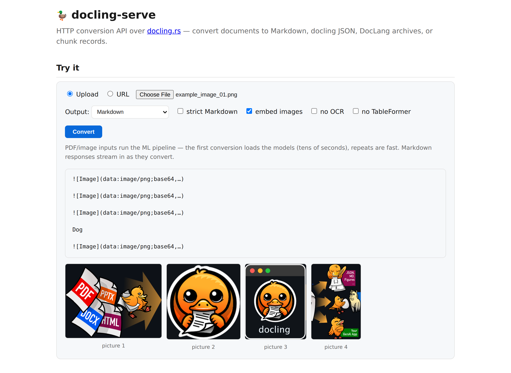

# docling.rs

<p align="center">
  
</p>

<p align="center">
  <a href="https://github.com/docling-project/docling.rs/actions/workflows/ci.yml"></a>
  <a href="https://docling-project.github.io/docling.rs/"></a>
  <a href="https://docs.rs/docling"></a>
  <a href="https://crates.io/crates/docling"></a>
  <a href="https://crates.io/crates/docling"></a>
  <a href="https://crates.io/crates/docling"></a>
  <br>
  <a href="https://www.npmjs.com/package/docling.rs"></a>
  <a href="https://www.npmjs.com/package/docling.rs"></a>
  <a href="https://www.npmjs.com/package/docling.rs-wasm"></a>
  <a href="https://pypi.org/project/docling-rs/"></a>
  <a href="https://pypi.org/project/docling-rs/"></a>
  <a href="https://pepy.tech/projects/docling-rs"></a>
  <br>
  <a href="https://github.com/docling-project/docling.rs/pkgs/container/docling-rs-serve"></a>
  <a href="https://github.com/docling-project/docling.rs/pkgs/container/docling-rs"></a>
  <a href="https://github.com/docling-project/docling.rs/releases"></a>
  <a href="https://opensource.org/licenses/MIT"></a>
  <a href="https://lfaidata.foundation/projects/"></a>
</p>

A Rust port of [docling](https://github.com/docling-project/docling): convert
documents into a unified `DoclingDocument` for downstream AI workflows.

**Fast and small:** one static binary, no Python/PyTorch at runtime. The PDF
ML pipeline runs **4.3× faster** than Python docling at **2.3–2.6× less peak
RAM**; declarative formats (DOCX/HTML/XLSX/…) convert **20–60× faster** at
**~60× less memory** — methodology and per-fixture numbers in
[`docs/PDF_CONFORMANCE.md`](./docs/PDF_CONFORMANCE.md).

The format migration is **complete** — every document format in docling's
pipeline is supported, validated byte-for-byte against live docling. See
[`docs/MIGRATION.md`](./docs/MIGRATION.md) for the full architecture, the Python → Rust
mapping, and per-format conformance.

**▶ [Try it in your browser](https://docling-project.github.io/docling.rs/)** —
the whole converter compiled to wasm: drop a DOCX, PDF, XLSX, EPUB … and get
Markdown, docling JSON, DocLang XML or LaTeX back. Nothing is uploaded; the page runs
entirely on your device, phone included. Scanned pages can be OCR'd there too
(layout + PP-OCR + TableFormer via ONNX Runtime Web) once you point it at the
models. See [`crates/docling-wasm`](./crates/docling-wasm/README.md).

Developed with **Claude Code** and _[TENET](https://github.com/artiz/tenet/tree/master)_ (minimalistic spec driven design framework).

## Status

The public API works end to end across **Markdown, CSV, HTML, AsciiDoc, DOCX,
PPTX, XLSX, legacy DOC/XLS/PPT, Apple iWork, EPUB, ODF, RTF, WebVTT, Email, MHTML, JATS, USPTO,
XBRL, LaTeX, JSON, PDF, images, METS, audio and video** — plus Markdown / docling-JSON output and image
extraction. The full extension map (`InputFormat::from_extension`, mirroring
docling's `FormatToExtensions`):

| Category | Extensions |
|---|---|
| Text & markup | `.md` `.txt` `.text` `.qmd` `.rmd` · AsciiDoc `.adoc` `.asciidoc` `.asc` · HTML `.html` `.htm` `.xhtml` (any charset: BOM, declared `<meta charset>`, UTF-8, windows-1252 fallback) · MHTML `.mhtml` `.mht` · LaTeX `.tex` `.latex` |
| Word processing | DOCX `.docx` `.docm` `.dotx` `.dotm` · Word 97–2004 `.doc` `.dot` · OpenDocument `.odt` `.ott` (flat `.fodt`) · OpenOffice 1.x `.sxw` `.stw` `.sxg` · StarWriter 3–5 `.sdw` `.vor` · AbiWord `.abw` `.zabw` `.awt` · WordPerfect 5.x/6.x+ `.wpd` `.wp` `.wp5` `.wp6` `.wpt` · Microsoft Works 2–9 `.wps` · EPUB `.epub` · RTF `.rtf` |
| Presentations | PPTX `.pptx` `.pptm` `.potx` `.potm` `.ppsx` `.ppsm` · PowerPoint 97–2003 `.ppt` `.pot` `.pps` · OpenDocument `.odp` `.otp` (flat `.fodp`) · OpenOffice 1.x `.sxi` `.sti` · StarImpress/StarDraw 3–5 `.sdd` `.sda` |
| Diagrams | Visio `.vsdx` `.vsdm` — pages as sections, shape text in reading order, connectors as a relations table · SVG `.svg` — rasterized (resvg) into the image ML pipeline; without ML or with `--no-ocr`, `<text>` elements extract directly into reading-order paragraphs |
| Spreadsheets | XLSX `.xlsx` `.xlsm` (templates `.xltx` `.xltm`) · binary XLSB `.xlsb` · Excel 97–2004 `.xls` `.xlt` · OpenDocument `.ods` `.ots` (flat `.fods`) · OpenOffice 1.x `.sxc` `.stc` · CSV `.csv` `.tsv` · dBase `.dbf` · DIF `.dif` · SYLK `.slk` `.sylk` · Lotus 1-2-3 / Symphony `.wk1` `.wk2` `.wk3` `.wk4` `.wks` `.wrk` `.123` · Quattro Pro `.wq1` `.wq2` `.wb1` `.wb2` `.wb3` `.qpw` · MS Works 6–9 `.xlr` · MS Works `.wks` |
| Apple iWork | Pages `.pages` · Numbers `.numbers` · Keynote `.key` — Pages mirrors docling's reader (#318): both generations (2013+ `Index/*.iwa` and iWork '09 `index.xml`), title/heading labels from paragraph styles, tables as grids, byte-identical Markdown; Numbers/Keynote are text-level extensions (#213): slide text, sheet/table names + cell text |
| XML dialects | JATS / USPTO / XBRL (`.xml` `.nxml`, content-sniffed) · DocLang `.dclg` |
| PDF & images | `.pdf` · `.png` `.jpg` `.jpeg` `.tif` `.tiff` `.bmp` `.webp` `.gif` · HEIC/HEIF `.heic` `.heif` (opt-in `--features heif`, links the system libheif — #211) · METS/GBS scan packages `.tar.gz` |
| docling native | docling JSON `.json` · DocTags `.doctags` `.dt` · DCLX `.dclx` |
| Mainframe data | EBCDIC `.ebc` `.ebcdic` — fixed-width record files decoded through a COBOL copybook layout (docling's `EbcdicLayout` JSON: cp037/cp500/cp1140 text, COMP/COMP-3/zoned numerics with implied decimal scale, multi-schema record-type prefixes); pass the layout via `ebcdic_layout` (inline JSON or path) or drop a `<stem>.layout.json` sidecar next to the file |
| Email & subtitles | `.eml` · Outlook `.msg` (CFB/MAPI, projected onto RFC 822 — same output as the equivalent `.eml`; optional `list_attachments` appends attachment names + content types) · WebVTT `.vtt` |
| Audio | `.wav` `.mp3` `.mpga` `.m4a` `.aac` `.ogg` `.flac` |
| Video | `.mp4` `.avi` `.mov` `.mkv` `.webm` `.mpeg` `.mpg` |

Raw **DocTags** (`.doctags`/`.dt` — the token markup docling's VLMs emit) reads
in through `docling-core`'s tolerant DocTags parser (#152), the same one the
VLM pipeline uses for model responses.
MHTML is a docling.rs-only extension (docling has no MHTML
backend): saved-webpage `.mhtml`/`.mht` archives are parsed as a MIME message
with [`mail-parser`](https://crates.io/crates/mail-parser) (which conforms to
[RFC 2557](https://datatracker.ietf.org/doc/html/rfc2557), the MHTML spec) and
routed through the HTML backend, with embedded images resolved from the
archive by `Content-Location`/`cid:`. The discriminative PDF/image pipeline
lives in `docling-pdf`: a pure-Rust PDF text parser, pdfium for page
rasterization, and an ONNX layout/TableFormer/OCR stack. TableFormer is ported
to ONNX and run on every detected table region to recover its structure;
geometric reconstruction from cell positions remains only as the fallback when
the TableFormer graphs aren't present (see `docs/PDF_CONFORMANCE.md`).

**Audio/ASR** (docling's Whisper pipeline) lives in `docling-asr`, and it is
Rust all the way down: [`symphonia`](https://crates.io/crates/symphonia)
demuxes/decodes the container in-process (wav, mp3, flac, ogg, aac, m4a; no
ffmpeg), a ported log-mel front-end feeds a
**Whisper tiny** encoder/decoder exported to ONNX (run on `ort`, greedy with
OpenAI's timestamp rules — docling's ASR defaults), and each segment becomes a
`[time: start-end] text` paragraph. The transcription language is
auto-detected from the first 30 seconds (docling 2.116 parity); pin it with
`--asr-lang <code>` (a Whisper code like `en`, `de`, `zh`; `auto` re-enables
detection), the `asr_lang` option on the other surfaces, or the
`DOCLING_RS_ASR_LANG` environment variable. **Video** inputs (`mp4`/`mov`/`mkv`/`webm`, docling's
`InputFormat.VIDEO`) take the same path: symphonia demuxes the audio track
(isomp4/Matroska readers) and the transcript becomes the document. When the
`ffmpeg` **binary** is present (runtime detection — no build dependency;
`DOCLING_FFMPEG` overrides the path), up to `--video-frames N` frames (default
8) are also sampled — scene changes first, evenly spaced fallback — and
interleave with the transcript as `[time: <ts>]`-captioned pictures, PNGs
embedded in JSON/DCLX output. Without ffmpeg, or with `--video-frames 0`, a
video converts to its transcript alone; a video with *no* audio track converts
to its frames alone. What symphonia can't decode in-process — Ogg **Opus**
(the codec of Telegram/WhatsApp voice messages) and **AVI** containers —
falls back to the same optional ffmpeg binary when present; without ffmpeg
those inputs fail with a targeted message and an install hint.

<details>
<summary><b>Installing ffmpeg</b> (optional — only for video frame sampling)</summary>

Any ffmpeg ≥ 4.x on `PATH` works; docling.rs shells out to the binary and
parses its output, so no dev headers/libraries are needed.

- **Debian/Ubuntu**: `sudo apt-get install ffmpeg`
- **Fedora**: `sudo dnf install ffmpeg-free` (or `ffmpeg` from RPM Fusion)
- **Alpine**: `apk add ffmpeg`
- **macOS**: `brew install ffmpeg`
- **Windows**: `winget install ffmpeg` (or `choco install ffmpeg`, or
  `scoop install ffmpeg`). Installing from a downloaded zip
  ([gyan.dev](https://www.gyan.dev/ffmpeg/builds/) /
  [BtbN](https://github.com/BtbN/FFmpeg-Builds/releases)) also works — either
  add the extracted `bin\` folder to `PATH`, or skip `PATH` entirely and point
  `DOCLING_FFMPEG` at the exe:
  `set DOCLING_FFMPEG=C:\tools\ffmpeg\bin\ffmpeg.exe`

Check with `ffmpeg -version`. `DOCLING_FFMPEG` overrides the binary used on
any OS; the docling-rs-serve Docker image ships ffmpeg preinstalled.
</details>

Output is checked against upstream Python docling — declarative formats
byte-for-byte against live docling, the ML pipeline against a deterministic
snapshot baseline. See [`docs/MIGRATION.md`](./docs/MIGRATION.md) and
`scripts/conformance/conformance.sh`.

## RAG subsystem

[`crates/docling-rag`](./crates/docling-rag) builds a pluggable
Retrieval-Augmented-Generation layer on top of the converter: it turns documents
into Markdown, chunks them (streaming sliding window, or docling's
hierarchical/hybrid chunkers via `RAG_CHUNKER`), embeds the chunks, and
stores them in a vector database for semantic search. Every external dependency is
a swappable trait — embedders (**Ollama**/Gemini/local-ONNX), vector stores
(**SQLite+sqlite-vec**/PostgreSQL+pgvector), LLM (**OpenRouter**, `deepseek/deepseek-chat` by default),
document sources (**folder**/FTP/SFTP), and message queues
(**in-process**/RabbitMQ/Redis). It ships Hybrid, Multi-Query fusion and HyDE
retrieval plus an evaluation harness to compare configurations and an
API-key-protected REST API (`docling-rag serve`) for document info and
search — with a built-in single-page search UI at `GET /` (API key stored in
the browser's localStorage). A `--features cuda` build runs ingest conversion
*and* the local ONNX embedder on the GPU via the same `DOCLING_RS_EP` switch
as the rest of the stack. Configure it via [`.env`](./.env.example); see the
[crate README](./crates/docling-rag/README.md) for a quickstart on any
documents folder.

## HTTP conversion API — `docling-rs serve`

[`crates/docling-serve`](./crates/docling-serve) is the analogue of Python's
`docling-serve`: a long-running server exposing the converter over HTTP. One
warm PDF/image pipeline (layout/OCR/TableFormer stay loaded) is shared across
requests, so repeat PDF conversions skip the model load (~13× faster than a
cold call on the test fixtures); a semaphore bounds concurrent conversions.
Markdown responses stream (chunked transfer); `/health` + `/ready` suit
container probes, and SIGTERM drains in-flight requests before exit.
`GET /` serves API docs plus an interactive test form — upload or URL in,
streamed result out, with extracted pictures rendered below the text — and
`GET /openapi.yaml` describes the whole API (OpenAPI 3.1), so Swagger UI,
Redoc or a client generator can be pointed straight at a running server:

<p align="center">
  
</p>

```bash
cargo run --release -p docling-serve                 # 127.0.0.1:5001
# or: cargo run --release -p docling-cli --features serve -- serve

curl -F file=@paper.pdf localhost:5001/v1/convert                # Markdown
curl -F file=@report.docx 'localhost:5001/v1/convert?to=json'    # docling JSON
curl -F file=@sheet.xlsx  'localhost:5001/v1/convert?to=dclx' -O # DocLang archive
curl -F file=@page.html   'localhost:5001/v1/convert?to=chunks'  # chunk records
curl -F file=@paper.pdf   'localhost:5001/v1/convert?to=images&pages=1-3'  # pages → PNG (base64 JSON)
curl -H 'content-type: application/json' \
     -d '{"url": "https://example.com/doc.pdf", "to": "md"}' \
     localhost:5001/v1/convert     # fetch a URL (needs --allow-url-fetch)

curl -F file=@a.pdf -F file=@b.docx localhost:5001/v1/convert    # batch → JSON results array

id=$(curl -F file=@big.pdf localhost:5001/v1/convert/async | jq -r .task_id)
curl localhost:5001/v1/status/$id                                # pending|started|success|failure
curl localhost:5001/v1/result/$id                                # the output, once done
```

Long conversions don't have to hold the connection: `POST /v1/convert/async`
accepts the same request and returns a task id immediately — poll
`/v1/status/{id}`, fetch `/v1/result/{id}` (kept `--result-ttl` seconds,
default 10 min; at most `--queue-size` jobs queue at once). Several `file`
parts in one request convert as a batch with per-item status. PDF/image
responses carry a conversion-confidence report (docling-serve v1.25 parity):
an `X-Docling-Confidence` summary header (grades `poor`/`fair`/`good`/
`excellent` + layout/OCR/parse scores) on every format, and the full per-page
report under a top-level `confidence` key in `to=json` bodies.

`to=images` skips conversion entirely and rasterizes a PDF's pages to PNG
through pdfium — `{"pages": [{"page", "width", "height", "png_base64"}]}` —
honoring `pages=A-B` and a `scale` of 0.1–4.0 pixels per PDF point (default
2.0 = 144 dpi). Capped at 100 pages per request
(`DOCLING_RS_MAX_RASTER_PAGES`); narrow big documents with `pages`.

Options per request: `to=md|json|dclx|chunks|latex|images`, `strict`, `images=placeholder|embedded`,
`skip_empty_cells`, `compact_tables`,
`no_ocr`, `skip_ocr`, `no_table_former`, `no_text_panels`, `heading_hierarchy`, `force_full_page_ocr`, `pages`,
`ocr_lang`, `ocr_mode`, `ocr_scale`, `scale`, `asr_model`, `asr_lang`, `video_frames`, `fetch_images`,
`chunker=hierarchical|hybrid`, `chunk_tokenizer`, `chunk_max_tokens`, `chunk_merge_peers` (#256:
per-request `to=chunks` configuration; the tokenizer is a server-local relative path),
`pipeline=standard|vlm` + `vlm_endpoint`, `vlm_model`, `vlm_api_key`, `vlm_prompt`,
`vlm_max_tokens` (#304: the remote [VLM pipeline](#vlm-pipeline-remote-endpoint); a
request-supplied `vlm_endpoint` needs `--allow-url-fetch` and passes the same SSRF
check as URL inputs — pin it server-side via `DOCLING_RS_VLM_*` instead for the safer
operator-controlled mode) — as query
parameters, multipart fields, or JSON keys (body wins). Server flags: `--addr`,
`--concurrency`, `--max-body-mb`, `--queue-size`, `--result-ttl`, `--warmup`,
`--allow-url-fetch`, `--no-url-fetch`, `--strict`, `--max-memory-mb` (#263:
memory ceiling for admission control — explicit, or `DOCLING_RS_MAX_MEMORY_MB`,
else the container's cgroup limit; once RSS crosses 85% of it — tunable via
`DOCLING_RS_MEMORY_WATERMARK_PCT` — new conversions get 503 + Retry-After
instead of OOM-killing the process; `0` disables). Thread pools are
**cgroup-quota-aware** (#262; `DOCLING_RS_TF_INTRA` further narrows the shared
TableFormer session — the reporter's 4-CPU case dropped ~40% peak memory), and
the server defaults `DOCLING_RS_NO_ARENA=1`: with the ONNX CPU arena off plus
heap trimming, warm retained RSS measured ~3× lower (2.0 GB → 0.7 GB) at no
latency cost — set `DOCLING_RS_NO_ARENA=0` to restore the arena. Prebuilt
multi-arch images (`linux/amd64`, `linux/arm64`) publish to GHCR:
`ghcr.io/docling-project/docling-rs-serve:latest` (the server) and
`ghcr.io/docling-project/docling-rs:latest` (the CLI, `docker run --rm -v
"$PWD:/data" ghcr.io/docling-project/docling-rs report.pdf --to md`), both
built from [`crates/docling-serve/Dockerfile`](./crates/docling-serve/Dockerfile)
with models and pdfium baked in (or mountable with `--build-arg
FETCH_ASSETS=0`). Docker
Compose setups are in [`examples/docker-compose/`](./examples/docker-compose/) and
the full guide is in [`docs/DEPLOYMENT.md`](./docs/DEPLOYMENT.md).
URL inputs are **off by default** (SSRF surface): pass `--allow-url-fetch` to
enable them; the fetcher blocks private-IP targets
(`DOCLING_RS_ALLOW_PRIVATE_IP_FETCH=1` opts out) and caps the download size
(`DOCLING_RS_MAX_FETCH_BYTES`). The server binds loopback by default — front
it with a policy proxy for anything wider.
The JSON body also takes docling's service-datamodel `sources`/`target` shape
(#139): `kind`-tagged `file` (base64) and `http` (URL + headers) sources, and —
with the opt-in `cloud` cargo feature (feature-gated `object_store`) — `s3`,
`azure_blob` and `google_cloud_storage` sources and output targets, coordinate
fields mirroring upstream's models. A cloud target uploads each converted
output as `<stem>.<ext>` under the prefix and answers with a
`RemoteTargetResult` acknowledgment; everything outbound sits behind
`--allow-url-fetch`. The jobkit targets `zip` and `put` work too (#303, no
`cloud` feature needed): `{"kind": "zip"}` answers with one `application/zip`
archive of the `<stem>.<ext>` rendered outputs (a batch download — nothing
outbound, no gate; a failed batch item becomes a `<stem>.<ext>.error.txt`
entry), and `{"kind": "put", "url": …}` HTTP-PUTs each rendered output to the
given — typically pre-signed — URL, so upload credentials live in the URL the
caller minted, never in the request (behind `--allow-url-fetch`, with the same
SSRF resolution check as URL inputs and redirects disabled). See the
`s3_pipeline` example in `/openapi.yaml`.

Observability (#297, mirroring Python docling-serve's posture — metrics on by
default, traces opt-in): every request logs through `tracing` (`RUST_LOG`
filters, default `info`), and `GET /metrics` serves Prometheus text —
request counts by status class, an in-flight gauge, a request-latency
histogram, and per-outcome conversion counts (`/metrics`, `/health` and
`/ready` probes excluded). Building with the opt-in `otel` cargo feature and
setting `OTEL_EXPORTER_OTLP_ENDPOINT` additionally ships the request spans
over OTLP/gRPC (`OTEL_SERVICE_NAME` defaults to `docling-rs-serve`); without the
env var the feature is inert.

## In the browser — `docling-wasm`

The declarative converters (everything except the PDF/image/audio ML
pipelines) compile to `wasm32-unknown-unknown`:
[`crates/docling-wasm`](./crates/docling-wasm) exposes
`convert(bytes, filename, to)` → Markdown / docling JSON / DocLang / LaTeX via
`wasm-bindgen`, so DOCX/HTML/XLSX/PPTX/EPUB/… convert **fully client-side** —
no server, ~3.4 MB gzipped module, no models to download for the declarative
formats (the default-on browser-OCR feature does fetch its ONNX models) —
something Python docling has no equivalent for. Ready to use from npm:

```bash
npm i docling.rs-wasm
```

```js
import { convert } from "docling.rs-wasm";          // bundlers
// import init, { convert } from "docling.rs-wasm/web"; await init();  // no bundler
const markdown = convert(bytes, file.name, "md");
``` Digital PDFs convert too: the wasm build always compiles docling-pdf's
pure-Rust text-layer parser (the `pdf-text` feature of the `docling` crate;
the same extraction as `--no-ocr`: flat paragraphs, no headings/tables/pictures),
while scanned PDFs get a clear "needs OCR" error instead of an empty
document. The crate ships a drop-a-file demo page under
[`www/`](./crates/docling-wasm/www). Native builds are untouched: the
feature slices behind this (`pdf` / `asr` / `fetch-images`) all stay in the
`docling` default set, so a plain `cargo build` is unchanged.

## Integration — using docling.rs from your language

One engine, several front doors. Every surface takes the same options
(`to`, `strict`, `images`, `no_ocr`, `ocr_mode`, `heading_hierarchy`,
`pages`, …) and returns the same outputs (Markdown, docling JSON, DocLang
`.dclx`, LaTeX, chunk records).

| You write… | Use | Install | Details |
|---|---|---|---|
| Rust | the `docling` crate: `DocumentConverter` + `SourceDocument` | `cargo add docling` | [The API](#the-api) |
| a shell / CI job | the `docling-rs` CLI (`--to md\|json\|dclx\|chunks\|latex\|images`, `--input`/`--output` batch mode) | `cargo install docling-cli` · [release binaries](https://github.com/docling-project/docling.rs/releases) · `ghcr.io/docling-project/docling-rs` | [Batch conversion](#batch-conversion--input----output), [Install](#install-locally--in-ci-one-liner) |
| anything that speaks HTTP | `docling-serve`: `POST /v1/convert` (multipart or JSON), async jobs, OpenAPI 3.1 | `docker run -p 5001:5001 ghcr.io/docling-project/docling-rs-serve` · `cargo install docling-serve` | [HTTP conversion API](#http-conversion-api--docling-rs-serve), [docs/DEPLOYMENT.md](./docs/DEPLOYMENT.md) |
| Node.js / Bun / Electron | `docling.rs` (N-API addon): `convertFile`, `convert`, streaming, chunking, warm `Pipeline` | `npm i docling.rs` (`docling.rs-cuda` for GPU) | [Node bindings](#nodejs--bun-bindings), [crate README](./crates/docling-node/README.md) |
| Python | `docling-rs` — a drop-in for docling's `DocumentConverter` over the Rust engine | `pip install docling-rs` (`docling-rs-cuda` for GPU) | [Python bindings](#python-bindings), [migration guide](./crates/docling-py/README.md#migrating-from-python-docling) |
| the browser / Tauri / a PWA | `docling.rs-wasm`: `convert(bytes, name, to)` fully client-side, optional in-browser OCR/layout | `npm i docling.rs-wasm` | [In the browser](#in-the-browser--docling-wasm), [crate README](./crates/docling-wasm/README.md) |
| C, C++, C#/.NET, Go, Java, Swift, Zig, … | `docling-ffi`: `docling_convert(bytes, len, filename, options_json)` behind one `docling.h` | [release archives](https://github.com/docling-project/docling.rs/releases) `docling-ffi-<tag>-<target>` (library + header) | [C ABI](#c-abi-for-embedders--docling-ffi), [language quickstarts](./crates/docling-ffi/README.md#language-quickstarts) |
| a RAG stack | `docling-rag`: chunk → embed → search, REST API and web UI | `cargo install docling-rag` | [RAG subsystem](#rag-subsystem) |

Which one to pick: **Rust** when you're already in Cargo; **CLI** for scripts
and batch jobs (the ML models load once per run); **serve** when several
services or languages share one warm pipeline — models stay loaded, admission
control keeps memory bounded, and every language has an HTTP client;
**Node / Python** for in-process use from those runtimes with zero extra
services; **wasm** when the document must not leave the user's machine;
**FFI** for everything else that can call a C function. The ML assets
(`.models/`, `.pdfium/`) are the same for all of them — see
[Getting the ML models](#getting-the-ml-models); the Python and Node packages
fetch them on first use, the container images ship them baked in.

```bash
# CLI
docling-rs report.pdf --to md
docling-rs --input ./docs --output ./out --to latex
docling-rs --help        # every flag; --version reports the compiled-in features

# HTTP
curl -F file=@report.pdf 'localhost:5001/v1/convert?to=json&heading_hierarchy=true'
```

```js
// Node.js / Bun
import { convertFile } from 'docling.rs'
const { content } = convertFile('report.pdf', { to: 'markdown' })
```

```python
# Python — docling-shaped
from docling_rs import DocumentConverter
doc = DocumentConverter().convert("report.pdf").document
print(doc.export_to_markdown())
```

```js
// Browser (wasm) — nothing leaves the page
import init, { convert } from "docling.rs-wasm/web";
await init();
const tex = convert(new Uint8Array(await file.arrayBuffer()), file.name, "latex");
```

```c
/* C ABI — any language with FFI */
DoclingResult *r = docling_convert(bytes, len, "report.docx", "{\"to\":\"json\"}");
if (!docling_result_error(r)) fwrite(docling_result_output(r), 1, docling_result_output_len(r), stdout);
docling_result_free(r);
```

## The API

```rust
use docling::{DocumentConverter, SourceDocument};

let converter = DocumentConverter::new();
let result = converter
    .convert(SourceDocument::from_file("input.md").unwrap())
    .unwrap();

println!("{}", result.document.export_to_markdown()); // Markdown
println!("{}", result.document.export_to_json());     // docling DoclingDocument JSON
```

### Post-extraction table editing

Tables converted by the PDF ML pipeline carry **first-class cells**
(`Table::cells` — docling's `TableCell` shape: text, `[l, t, r, b]` page-point
bbox with a top-left origin, span rectangle and header roles from the
predicted structure, #240), serialized into the JSON export's `table_cells`
(and therefore visible to the Python/Node bindings), with the DocLang span
tokens (`<lcel/>`/`<ucel/>`/`<ched/>`) derived from them. `DoclingDocument`
exposes the tables for in-place repair (#238) — recover missing OCR text, fix
a misread cell, then re-export:

```rust
let mut document = converter.convert(source).unwrap().document;
for table in document.tables_mut() {
    // Locate the cell an external OCR box refers to (best IoU) and fix it…
    if let Some((row, col)) = table.find_cell_by_bbox([310.0, 224.0, 351.0, 231.0]) {
        table.set_cell_text(row, col, "corrected");
    }
    // …or in one call:
    table.update_cell_by_bbox([310.0, 224.0, 351.0, 231.0], "corrected");
}
println!("{}", document.export_to_markdown()); // repairs included
```

Updating a spanning cell through any covered position updates the whole cell
(record + every covered grid slot). `rows`, `structure` and `cells` are public
fields, so full reconstruction (inserting rows, rebuilding a borderless table
from corrected OCR) is ordinary `Vec` surgery; `set_cell_bbox` materializes
1×1 cells on demand. Declarative tables get their cells derived
from the parsed structure — real spans for DOCX/XLSX merged regions, ODF
covered cells and HTML `rowspan`/`colspan`, `th`-driven header roles — just
without page geometry (`bbox: None`), so a spreadsheet repair loop works the
same way.

### JSON output

`export_to_json()` emits docling-core's native `DoclingDocument` wire format
(schema `1.10.0`) — the same shape Python docling's `export_to_dict()` /
`save_as_json()` produce: a `body` tree of `$ref`s into `texts` / `groups` /
`tables` / `pictures`, with labels (`title`, `section_header`, `list_item`,
`code`, `formula`, …), list grouping, and table grids. The output loads straight
back into Python docling-core (`DoclingDocument.load_from_json(...)`) and
round-trips to the same Markdown.

> Note: docling.rs's model bakes inline formatting (bold, links, inline math)
> into the text, so for those spans the JSON carries the rendered text rather
> than docling's structured `formatting` / `hyperlink` fields. Block structure,
> headings, lists, tables, code and display equations match.

### DocLang (`.dclx`) output

`export_to_doclang()` renders the document as **DocLang** — docling 2.110's
XML serialization (`<doclang version="0.7">`) of the `DoclingDocument` tree:
headings, paragraphs, rich inline runs (`<bold>` / `<italic>` / `<underline>` /
`<strikethrough>` / `<subscript>` / `<superscript>`), lists with enumeration
`<marker>`s, tables with per-cell `<location>` provenance, code blocks with a
language `<label>`, formulas, pictures and furniture. The pretty-printed
indentation follows Python's `minidom.toprettyxml` byte-for-byte.

```rust
println!("{}", result.document.export_to_doclang()); // <doclang> XML string
```

Wrap that XML in an OPC archive — the `.dclx` container docling's
`save_as_doclang()` writes (`[Content_Types].xml` + `_rels/.rels` +
`document.xml`) — with `docling::dclx::save_as_dclx`:

```rust
use std::path::Path;
docling::dclx::save_as_dclx(&result.document, Path::new("out.dclx")).unwrap();
```

From the CLI, `--to dclx` writes `<input-stem>.dclx` next to the CWD:

```sh
cargo run -p docling-cli -- --to dclx crates/docling/sample.html   # -> sample.dclx
```

`--to images` (#243) is the CLI counterpart of serve's rasterization: it skips
conversion and writes a PDF's pages as `<stem>_page_NNNN.png` files (CWD, or
`--output DIR` in batch mode), honoring `--pages A-B` (absolute page numbers
survive the window) and `--scale` (0.1–4.0 px per PDF point, default 2.0 =
144 dpi):

```sh
docling-rs --to images --pages 2-3 --scale 1.5 paper.pdf  # -> paper_page_0002.png, paper_page_0003.png
```

Conformance against docling's own `.dclx` output is tracked by
`scripts/conformance/gen_dclx.py` (generates the groundtruth) and
`scripts/conformance/dclx_conformance.sh` (line-diffs the extracted
`document.xml`).

### LaTeX (`.tex`) output

`export_to_latex()` renders a complete LaTeX document — docling 2.124's
`--to latex` (#317), the Rust counterpart of docling-core's
`LaTeXDocSerializer` with its default parameters: the `article` preamble and
package list, a document title hoisted into `\title{}` + `\maketitle`,
`\section`/`\subsection`/`\subsubsection` headings, `itemize`/`enumerate`
lists (nested environments indented two spaces), `table`/`tabular` grids with
`\hline` rules and captions (rich cells render their lists / nested tables
inline), `figure` environments with a `% image` placeholder and the picture
classification as a `% annotation` comment, `verbatim` code, `$$…$$` formulas,
inline formatting as `\textbf{}` / `\textit{}` / `\sout{}` / `\texttt{}` /
`\href{}{}` / `$…$`, and LaTeX escaping of every special character in text.

Scored against Python docling's **own** `docling --to latex` output on the
shared declarative corpus (md, docx, html, pptx, xlsx, asciidoc, csv, webvtt,
jats): **93 of 116 fixtures byte-exact**, 98 once upstream's duplicated
formatted list items / headings are normalized away (see below). The
remaining differences are model gaps rather than serializer bugs: underline
and sub/superscript have no Markdown form and stay plain text; HTML rich
table cells (lists / nested tables inside a `<td>`) are flattened; a few
list-grouping and furniture placements differ. The regression suite
(`crates/docling/tests/regression.rs`) pins every fixture's `.tex`.

```rust
println!("{}", result.document.export_to_latex()); // \documentclass … \end{document}
```

`--to latex` on the CLI prints it (batch mode writes `<stem>.tex`), serve
answers `to=latex` as `text/x-tex` (inline under `latex` in a batch), and the
Node bindings take `to: 'latex'`. The Python bindings need nothing: their
`result.document` *is* upstream docling-core's `DoclingDocument`, so
`LaTeXDocSerializer(doc=result.document).serialize().text` applies directly.
Two deliberate deviations: upstream raises on a heading deeper than
`\subsubsection`, docling.rs degrades those to `\paragraph` /
`\subparagraph` instead of failing the conversion; and upstream emits the
text of a *formatted* list item or heading twice (inside `\item` /
`\section{}` and again as its own paragraph —
[docling-core#740](https://github.com/docling-project/docling-core/issues/740)),
which docling.rs does not reproduce.

DocLang also reads back **in**: `.dclg`/`.dclg.xml` (bare DocLang XML) and
`.dclx` archives are input formats like any other —
`convert(SourceDocument::from_file("doc.dclx")?)` — scored byte-for-byte
against live docling reading the same archives (15/15 exact,
`tests/data/doclang`).

### Chunking (docling's Hierarchical & Hybrid chunkers)

`docling_core.transforms.chunker` ported to Rust — the chunkers RAG pipelines
feed to embedding models, scored against live docling's output on the same
corpus:

```rust
use docling::chunker::{contextualize, HierarchicalChunker, HybridChunker, HuggingFaceTokenizer};

let chunks = HierarchicalChunker.chunk(&result.document);          // structure-driven
let tok = HuggingFaceTokenizer::from_file(".models/chunk/tokenizer.json", 256)?; // feature "chunking"; fetched by download_dependencies.sh
for chunk in HybridChunker::new(tok).chunk(&result.document) {
    let embed_me = contextualize(&chunk); // heading path + chunk text
}
```

Same thing from Python (the `docling_rs` package runs these natively):

```python
from docling_rs import DocumentConverter
from docling_rs.chunking import HierarchicalChunker, HybridChunker

docling_rs.download_models()
doc = DocumentConverter().convert("report.docx").document

for chunk in HierarchicalChunker().chunk(doc):
    print(chunk.meta.headings, chunk.text)

chunker = HybridChunker(max_tokens=256)
for chunk in chunker.chunk(doc):
    embed_me = chunker.contextualize(chunk)  # heading path + chunk text
```

`HierarchicalChunker` yields one chunk per document item (whole lists, triplet-
serialized tables — `row, column = value` — picture captions), each carrying its
heading path. `HybridChunker` refines them with a tokenizer: splits oversized
chunks (at item boundaries, then with docling's `semchunk` algorithm inside
text; tables line-by-line), and merges undersized same-heading neighbours. The
HuggingFace tokenizer (MiniLM etc.) sits behind the `chunking` cargo feature
(on by default in the CLI); `--to chunks` dumps both chunkers' records.
`scripts/install/download_dependencies.sh` fetches MiniLM's tokenizer to
`.models/chunk/tokenizer.json`, which every surface picks up automatically when
no explicit tokenizer path is given (`DOCLING_CHUNK_TOKENIZER` overrides the
path and `DOCLING_CHUNK_MAX_TOKENS` the 256-token budget; per-run overrides:
`--chunker hierarchical|hybrid`, `--chunk-tokenizer`, `--chunk-max-tokens`,
`--no-chunk-merge-peers` on the CLI and the matching serve request fields,
#256). The chunkers are also
exposed in the [Node bindings](./crates/docling-node) (`chunkFile` /
`chunkDocument` + async variants), the
[Python bindings](./crates/docling-py) (`docling_rs.chunking`), and the
[RAG subsystem](./crates/docling-rag) (`RAG_CHUNKER=window|hierarchical|hybrid`, `window` default). Conformance vs
docling's chunkers over the 83-doc corpus (`scripts/conformance/
chunks_conformance.sh`): **hierarchical 98.8% / hybrid 96.2% identical chunk
records** (text + headings), 79 and 76 of 83 documents fully exact.

### Image extraction

Backends that have the image populate `Node::Picture { image }`: the PDF/image
pipeline crops figure regions, the DOCX / PPTX / MHTML backends pull embedded
image blobs (MHTML resolves `` against the archive's own MIME parts —
no network/filesystem access needed, so it's on by default), and — opt-in —
the HTML / EPUB backends fetch `` (see below).
Pick how pictures render with an [`ImageMode`] — the analogue of docling's
`image_mode`:

```rust
use docling::ImageMode;

// self-contained Markdown: 
let (md, _) = result.document.export_to_markdown_with_images(ImageMode::Embedded, "artifacts");

// referenced:  + the bytes to write
let (md, files) = result.document.export_to_markdown_with_images(ImageMode::Referenced, "artifacts");
for (path, bytes) in files { std::fs::write(path, bytes).unwrap(); }
```

`export_to_json()` always embeds extracted images as docling `ImageRef`s
(`data:` URIs + size). The default `export_to_markdown()` stays
`<!-- image -->`, like docling.

> The cropped/extracted pixels are real, but the base64 won't be byte-identical
> to docling's (different PNG encoder). HTML/EPUB/AsciiDoc pictures stay
> placeholders by default (like docling); enable fetching with `--fetch-images` /
> `DocumentConverter::fetch_images(true)` to resolve `` and AsciiDoc's
> `image::target[]` — `data:` URIs, local files, remote `http(s)` URLs, and EPUB
> archive entries — and embed the bytes. Remote URLs are fetched over the
> network, so enable it only for input you trust.

### `strict` Markdown (Rust-only)

By default `export_to_markdown()` reproduces docling's output byte-for-byte,
quirks included (`***x*** .`, dropped code-fence languages, `\_` escaping). Set
`strict(true)` for cleaner, more conformant Markdown:

```rust
let converter = DocumentConverter::new().strict(true);
let result = converter.convert(source).unwrap();
println!("{}", result.document.export_to_markdown()); // ```rust kept, no `***x*** .`, `_` not escaped
```

```text
legacy:  Foo ***both*** .   |   ``` (lang dropped)   |   Name: \_\_\_
strict:  Foo ***both***.    |   ```rust (lang kept)  |   Name: ___
```

`result.document.export_to_markdown_with(strict)` overrides the mode per call.
Python docling has no such switch.

### Streaming Markdown

For embedding in real apps, `convert_streaming` returns the document's Markdown
as an iterator of chunks instead of one big string — handy for piping a long
document straight to stdout, an HTTP response, or a socket as it is produced:

```rust
use std::io::Write;
use docling::{DocumentConverter, SourceDocument};

let source = SourceDocument::from_file("input.pdf").unwrap();
let mut out = std::io::stdout();
for chunk in DocumentConverter::new().convert_streaming(source).unwrap() {
    out.write_all(chunk.unwrap().as_bytes()).unwrap();
}
```

The headline win is PDF. The ML pipeline already processes pages **in parallel**;
streaming emits each page's Markdown **in document order, as soon as it is ready**
(with a one-page look-ahead so paragraphs that wrap across a page break still
merge), so output starts flowing before the last page is done. The conversion
runs on a background thread and the chunk iterator applies backpressure; dropping
it cancels the work. Concatenating every chunk is **byte-identical** to the
buffered `export_to_markdown()`.

Streaming is Markdown-only — JSON serializes docling-core's reference-based tree
and needs every node up front. Every image mode streams
(`convert_streaming_images(source, mode)` picks it): placeholders and `embedded`
data URIs render inline, and `referenced` (issue #80) writes each page's image
files under the converter's `artifacts_dir` **as that page's Markdown is
emitted**, then drops the bytes — an image-heavy PDF holds ~one page of images
in memory instead of all of them until export.

`--pages A-B` (issue #80; also `Pipeline::pages` /
`DocumentConverter::page_range`, `pages` in serve/Node, `page_range=` in
Python) converts only that 1-based inclusive PDF page window. Out-of-window
pages are skipped *before* rasterization, so 3 pages of a 500-page PDF cost 3
pages; `B` past the end clamps, and a window that selects nothing is an error.

The CLI streams Markdown by default (`--no-stream` opts back into buffering;
`--to json` always buffers). `--no-table-former` skips
loading/running the TableFormer table-structure model, falling back to simple
geometric table reconstruction from cell positions — no model load, no
per-table inference, which can noticeably speed up parsing (especially in
streaming mode) at the cost of table fidelity. `--no-ocr` goes further and
skips layout detection, OCR, and TableFormer entirely — no ML inference at
all, only the PDF's embedded text cells grouped into flat paragraphs by
reading order (no headings/lists/tables/pictures). It's the fastest PDF path
by a wide margin, but a scanned/image-only PDF (no embedded text layer) comes
back empty rather than erroring, so a caller can detect that and re-convert
without the flag. `--skip-ocr` (#244) sits between the two: it keeps layout
detection and TableFormer but never runs (or loads) OCR — docling's
independent `do_ocr=False`, the counterpart of `--no-table-former`. Structured
output — headings, tables, pictures, reading order — survives; only text that
exists solely as pixels is lost (scanned pages come back with empty regions,
and the speculative OCR of large embedded images never runs). Independently of
the flag, a *missing* OCR model now warns and degrades to the same behavior
instead of failing the conversion (`skip_ocr` in serve/Node,
`do_ocr=False` in Python — which now matches docling exactly; the old
skip-everything meaning moved to the Python-only `text_layer_only=True`).
`--force-full-page-ocr` is the opposite escape hatch
(docling's `force_full_page_ocr`): OCR every page from its rendered image
even when it carries a text layer — for layers that exist but lie (broken
encodings, subset fonts with garbage mappings, a scanned form with a few
typed-in field values). Ignored under `--no-ocr`, mirroring docling. The same
switch is available on every surface: `force_full_page_ocr(bool)` on the
library builder, a `force_full_page_ocr` option in docling-rs-serve, the
`force_full_page_ocr=` kwarg in Python, `forceFullPageOcr` in Node, and the
"Force OCR" toggle in the wasm demo.

`--no-text-panels` keeps every detected picture as a picture: it disables the
demotion of uncaptioned dense-text "picture" regions into paragraphs (the
recovery that turns misdetected text panels back into text, issue #173).

Scanned pages with a `/Rotate` flag (a scan that came in sideways or
upside-down — the most common defect of real-world scans) are normalized
before layout/OCR: the raster is un-rotated to upright for inference and the
output geometry is mapped back to display coordinates, so all four
orientations of the same scan OCR identically. Pages rotated *physically in
the raster* (a sideways phone photo, a landscape-fed sheet — `/Rotate 0`, so
the flag says nothing) are caught too: the recognizer probes a handful of
line crops under each 90° hypothesis and un-rotates when a rotated reading
clearly beats the upright one, page by page, before any inference. The pass
runs only on pages with no text layer, degrades to a no-op when the evidence
is thin, and can be disabled with `DOCLING_RS_OCR_ORIENTATION=off`.
Note on the OCR default:
`--ocr-lang en` (the default) uses an English PP-OCRv3 recognition model with
good Latin word spacing; the docling conformance corpus, however, was
generated with the multilingual `ch_` model — if you're comparing output
against Python docling byte-for-byte, run with `--ocr-lang ch`
(`DOCLING_RS_OCR_LANG=ch`). On ordinary scans `en` reads better; on the
conformance fixtures `ch` matches the groundtruth exactly.

Two more OCR knobs mirror docling 2.116+ options (#254), on every surface
(CLI flag, `DocumentConverter`/`Pipeline` builder, serve option, Python
kwarg, Node option):

- `--ocr-mode default|full_page|layout_regions|pdf_aware_layout_regions`
  (`DOCLING_RS_OCR_MODE`) — docling's `OcrMode`, i.e. which regions feed the
  OCR. The default (= `pdf_aware_layout_regions`) is the text-layer-aware
  behavior this pipeline has always had; `full_page` and `layout_regions`
  both discard the embedded text layer, exactly like `--force-full-page-ocr`
  (the upstream distinction between them — whole-page vs per-region
  *detector* input — has no analogue here, since the PP-OCR recognizer
  always reads per-region line crops).
- `--ocr-scale X` (`DOCLING_RS_OCR_SCALE`) — docling's `OcrOptions.scale`:
  the resolution OCR reads, in pixels per PDF point. Unset, OCR reads the
  pipeline's own 2.0 px/pt (144 dpi) page render — the pinned conformance
  baseline; a different value resamples that render for the OCR input only
  (layout and TableFormer pixels are untouched). docling's default is 3
  (216 dpi); lower it when the source raster is already high-resolution and
  upscaling degrades recognition.
Turn it on for image-extraction workflows over scanned documents whose
uncaptioned figures carry enough label text to look panel-like. Available on
every surface: `no_text_panels(bool)` on the library builder, a
`no_text_panels` option in docling-serve (with a "keep pictures" toggle in
the playground), the `no_text_panels=` kwarg in Python, and `noTextPanels`
in Node.

`--heading-hierarchy` (#302, docling's `HeadingHierarchyModel`) infers PDF/image
section-header *levels* after assembly. The layout model only flags regions as
headings, so by default every PDF heading lands at the same depth; with the
flag on, levels come from — in precedence order — the **PDF outline**
(bookmarks, fuzzily matched by title + page; a confidently matched heading
takes the bookmark's depth, and a bookmark-matched *list item* is promoted to
a heading), **legal/outline numbering** (`PART I → 1. → 1.1 → (a) → (i)`), and
**font style** (size with near-equal measurement merging, then weight, slant
and letter case from the embedded font names). Headings with no applicable
signal keep their level; nothing else about the document changes. Off by
default (docling parity — the docling groundtruth is produced with the stage
disabled). On every surface: `heading_hierarchy(bool)` on the library builder
(full `HeadingHierarchyOptions` on the `Pipeline`), a `heading_hierarchy`
serve option, the `heading_hierarchy=` kwarg in Python (also docling-shaped
via `PdfPipelineOptions.heading_hierarchy_options.enabled`), and
`headingHierarchy` in Node.

Two sparse-spreadsheet knobs (#271, docling.rs extensions, off by default —
default output stays byte-for-byte docling), on every surface (CLI flag,
`DocumentConverter` builder, serve option, Python kwarg, Node option):

- `--skip-empty-cells` — XLSX/XLS family: omit empty cells from each table
  row instead of materialising the full bounding box of every detected
  region. A ragged region's box is mostly padding on sparse sheets (a
  reported 2.7 MB workbook inflated ~7× over its content); a table that
  loses cells this way drops its merged-span overlay, and dense sheets are
  untouched.
- `--compact-tables` — all formats: render Markdown tables in the compact
  `| a | b |` form instead of the width-padded GitHub style. Grid semantics
  are unchanged — only inter-cell padding is dropped, which is what
  dominates the output size on sparse sheets.

### VLM pipeline (remote endpoint)

`--pipeline vlm` (issue #77) replaces the whole discriminative ML stack with a
Vision Language Model: each PDF page is rendered (pdfium) and sent to any
**OpenAI-compatible** vision endpoint — LM Studio, Ollama, vLLM, or a hosted
service — with docling's page-conversion prompt; the returned DocLang markup
is parsed by the same reader that `.dclg`/`.dclx` inputs use. An image input
is sent as-is (it is its own page). No ONNX models load at all; local
in-process VLM inference is a possible later enhancement.

```bash
docling-rs --pipeline vlm \
  --vlm-endpoint http://localhost:11434/v1 \
  --vlm-model granite-docling \
  paper.pdf
```

The same pipeline is exposed by the **Node bindings** as
`pipeline: 'vlm'` with `vlmEndpoint` / `vlmModel` / `vlmApiKey` / `vlmPrompt` /
`vlmMaxTokens` (see [Node.js / Bun bindings](#nodejs--bun-bindings)), by the
**Python bindings** as constructor kwargs with the same snake_case names
(#304; a bad configuration raises `ValueError` at construction):

```python
from docling_rs import DocumentConverter

conv = DocumentConverter(pipeline="vlm",
                         vlm_endpoint="http://localhost:11434/v1",
                         vlm_model="granite-docling")
doc = conv.convert("paper.pdf").document
```

and by **`docling-rs serve`** as the per-request options
`pipeline=vlm` + `vlm_endpoint` / `vlm_model` / `vlm_api_key` / `vlm_prompt` /
`vlm_max_tokens` (#304). On serve, a *request-supplied* `vlm_endpoint` is
outbound traffic steered by the caller, so it requires `--allow-url-fetch` and
passes the same SSRF resolution check as URL inputs (private/loopback
endpoints are refused; `DOCLING_RS_ALLOW_PRIVATE_IP_FETCH=1` for local
development). The safer default is the **operator-pinned mode**: set
`DOCLING_RS_VLM_ENDPOINT` / `DOCLING_RS_VLM_MODEL` (and optionally
`_API_KEY` / `_PROMPT`) on the server and have requests send just
`pipeline=vlm` — callers pick the pipeline, the operator picks where it talks
to, and no gate is needed:

```bash
curl -F file=@paper.pdf 'localhost:8000/v1/convert?pipeline=vlm'
```

A VLM failure (unreachable endpoint, non-200, unparseable answer) fails that
request with a clear error; the server itself is unaffected.

`--vlm-endpoint` takes the server's `/v1` base or the full
`…/chat/completions` URL. `--vlm-api-key TOKEN` (Bearer), `--vlm-prompt TEXT`
and `--vlm-max-tokens N` (default 8192) tune the rest (#312);
`DOCLING_RS_VLM_ENDPOINT` / `DOCLING_RS_VLM_MODEL` / `DOCLING_RS_VLM_API_KEY` /
`DOCLING_RS_VLM_PROMPT` are the env fallbacks for the corresponding flags, and
`DOCLING_RS_VLM_TIMEOUT` (seconds, default 600) raises the per-page request
cap for slow — e.g. CPU-served — endpoints. Selecting the pipeline is always
explicit: the environment supplies values, it never switches the pipeline on,
so a stale `DOCLING_RS_VLM_ENDPOINT` can't reroute an ordinary PDF conversion
over the network. The `--vlm-*` flags are inert on their own for the same
reason — without `--pipeline vlm` they are parsed and ignored, never a pipeline
switch of their own — and the Node bindings ignore stray `vlm*` options
identically. `--pages A-B` composes (only the window's pages are rendered
and sent), and `--to md|json|dclx|chunks` plus `--strict` work as usual. Transient
endpoint failures (timeouts, 408/429, 5xx) retry with exponential backoff;
a page that still fails fails the conversion — no silently dropped pages.

Answer grammars are auto-detected per response (#322): **DocTags**
(granite-docling-class models) and **DocLang XML** as before, plus
**Chandra** layout HTML (`<div data-bbox=… data-label=…>` blocks — tables
with spans, Form-held tables, lists, figures, page furniture; docling
2.123–2.125 semantics incl. `<br>`-as-spacing), **Unlimited-OCR** grounding
output (normalized into the DeepSeek-OCR annotation shape and parsed by
that backend), and raw **DeepSeek-OCR** annotated Markdown. Plain prose
still degrades to text — hostile model output never errors. Known models
also get their official prompts by name when `--vlm-prompt` isn't given:
`unlimited*` → the model-card `<image>document parsing.` (any other phrasing
returns an empty completion) plus the `skip_special_tokens=false` request
flag its grounding markers need; `chandra*` → docling's Chandra layout
prompt; everything else keeps the DocLang-eliciting default.
Output quality is entirely the model's; what docling.rs adds is measured
(#311): converting the PDF corpus through the same granite-docling endpoint
from both docling.rs and Python docling's `VlmPipeline` scores **87.7% mean
whitespace-normalized similarity over 18 fixtures, 3 byte-exact** — the gap
is dominated by each side rendering pages at its own scale (144 vs 216 dpi),
which greedy VLM decoding amplifies. Table and methodology:
[docs/PDF_CONFORMANCE.md](./docs/PDF_CONFORMANCE.md); harness:
`scripts/conformance/vlm_conformance.sh` (needs a GPU-served endpoint — CPU
inference measures hours per page).

### Headless-browser HTML pre-render (optional)

Almost everything in the HTML backend is pure Rust, but one thing a static
parse can't do is resolve the **CSS cascade** — whether a stylesheet- or
class-driven rule makes an element `display:none` (e.g. a collapsed nav menu).
The optional `--use-web-browser` flag renders the page in the system Chromium
first, drops every element the browser computes as hidden, then feeds the
cleaned HTML through the normal Rust backend (so all structure/table/KVP/
formatting logic still runs in Rust — the browser only decides visibility). It
applies to every HTML-routing input: direct HTML, plus MHTML and EPUB (which
assemble HTML from their archives). It's driven straight from Rust over the
DevTools protocol via
[`headless_chrome`](https://crates.io/crates/headless_chrome) — no Node,
Playwright, or other runtime.

It's gated behind the off-by-default `web-browser` Cargo feature, so the standard
build stays browser-dependency-free:

```bash
cargo run -p docling-cli --features web-browser -- --use-web-browser page.html
```

Chromium is located via `$DOCLING_RS_CHROME`/`$CHROME`, then
`$PLAYWRIGHT_BROWSERS_PATH/chromium`, else autodetected. The page's CSS must be
reachable for the cascade to resolve — inline `<style>` works offline, but a
saved page that links external stylesheets needs those fetchable (with a base
host). Without the feature, `--use-web-browser` is a clear error rather than a
silent no-op.

## Batch conversion — `--input` / `--output`

One warm process converts a whole tree of documents (#205): `--input` takes a
glob (quote it — the shell must not expand it) or a plain directory, `--output`
a directory, and the structure below the pattern's static prefix is preserved:

```bash
docling-rs --input '/data/reports/**/*.pdf' --output ./converted --to json
# /data/reports/2024/q1/a.pdf  ->  ./converted/2024/q1/a.json
docling-rs --input /data/reports --output ./converted
# a directory sweeps recursively, taking every file with a convertible
# extension (stray .log/.tmp files are ignored instead of failing the batch)
```

The PDF/image ML pipeline loads its models **once** and every matched file
reuses the warm sessions — the same amortization `docling-rs serve` does
across requests, without running a server. Extensions follow `--to` (`.md`,
`.json`, `.dclx`, `.chunks.json`, `.tex`), `--images referenced` writes each
document's pictures into a sibling `<stem>_artifacts/` directory, and every
other flag (`--strict`, `--pages`, `--ocr-lang`, `--pipeline vlm`, enrichment,
…) applies to the whole batch. `--jobs N` converts declarative formats in
parallel (PDF/image files share the one warm pipeline, which already
parallelizes internally per document). Output paths print to stdout one per
line for scripting; progress goes to stderr — a `start: <file> (N pages)`
line per document, a dot every 10 finished pages, and an
`ok: … (12.8s, 800 ms/page)` line when it completes. A failing file is
skipped rather than aborting the batch, and the exit code is non-zero if
anything failed — with one deliberate exception: an execution-provider
failure (an explicit `DOCLING_RS_EP` whose runtime libraries are missing)
would fail every remaining PDF identically, so the first one aborts the
whole batch (`fatal: …`, remaining files reported as `skipped`). `--output`
with a single positional file works too (a batch of one). Pipeline
diagnostics (e.g. the int8→fp32 layout-retry notice) are quiet by default;
`DOCLING_RS_DEBUG=1` turns them back on.

## Node.js / Bun bindings

docling.rs ships as an npm package, [**`docling.rs`**](https://www.npmjs.com/package/docling.rs)
— native TypeScript bindings (built with [napi-rs](https://napi.rs)) that live in
[`crates/docling-node`](./crates/docling-node). It's a real `.node` addon
that loads in both Node.js and Bun (Bun implements N-API — same binary, no
rebuild), exposing the converter with the same knobs as the Rust API: Markdown /
docling JSON output, `strict` mode, image modes, allowed-format restriction,
`fetchImages`, the [remote VLM pipeline](#vlm-pipeline-remote-endpoint)
(`pipeline: 'vlm'`), sync + async (`Promise`) calls, and a `streamFileMarkdown`
async generator.

Install — no Rust toolchain needed, the prebuilt binary for your platform (Linux
x64/arm64, Windows x64) is pulled in automatically:

```bash
npm install docling.rs   # or: bun add docling.rs
```

```ts
import { convert, convertFile, convertFileAsync } from 'docling.rs'

// in-memory bytes → Markdown
const md = convert({ name: 'notes.md', data: Buffer.from('# Hello\n\nWorld **bold**') })
console.log(md.content)

// a file → Markdown or docling JSON (format detected from the extension)
const { content } = convertFile('report.docx')
const json = await convertFileAsync('report.docx', { to: 'json' })
```

Declarative formats (Markdown, HTML, DOCX, XLSX, …) work out of the box. The
PDF/image pipeline needs pdfium + the ONNX models (not bundled), so it throws
until you fetch them with `scripts/install/download_dependencies.sh` — see
[Getting the ML models](#getting-the-ml-models) below. `pipeline: 'vlm'` is the
exception: it loads no ONNX models, so it needs pdfium alone (and nothing for
image input).

A reusable `Pipeline` keeps those models warm across many PDFs.

Runnable Node + Bun examples are in
[`crates/docling-node/examples`](./crates/docling-node/examples)
(`npm install && node node-basic.mjs`). See
[`crates/docling-node/README.md`](./crates/docling-node/README.md) for
the full API.

## Python bindings

docling.rs also ships as a PyPI package, **`docling-rs`** — PyO3 bindings (built
with [maturin](https://www.maturin.rs)) in
[`crates/docling-py`](./crates/docling-py). It's a *strangler-fig* drop-in for
docling's Python API: only the document processor is Rust, and
`result.document` is a genuine `docling_core` `DoclingDocument`, so
`export_to_markdown()`, `export_to_dict()`, `export_to_doctags()` and the
chunkers are docling's own Python code.

```python
# was:  from docling.document_converter import DocumentConverter
from docling_rs import DocumentConverter

result = DocumentConverter().convert("report.docx")
print(result.document.export_to_markdown())
data = result.document.export_to_dict()   # docling JSON wire format (schema 1.10.0)
```

Declarative formats (Markdown, HTML, DOCX, XLSX, …) work with no models; the
PDF/image pipeline downloads pdfium + the ONNX models on first use via
`docling_rs.download_models()`. On an NVIDIA machine install
**`docling-rs-cuda`** instead (same `docling_rs` module compiled with the CUDA
provider — GPU automatically, CPU fallback). See
[`crates/docling-py/README.md`](./crates/docling-py/README.md) for the full
API, local build steps, and a step-by-step
[migration guide from Python docling](./crates/docling-py/README.md#migrating-from-python-docling)
(swap the install, rewrite the imports, fetch the models — the code below the
imports stays unchanged).

## C ABI for embedders — `docling-ffi`

Embedding from C, C++, C#, Go, Java, Swift or anything else with FFI takes
one shared (or static) library and one header:
[`crates/docling-ffi`](./crates/docling-ffi) exposes a minimal `extern "C"`
surface — `docling_convert()` in, Markdown / docling JSON / DCLX / LaTeX out, with
conversion options as a single JSON object mirroring docling-serve's request
options. The [`include/docling.h`](./crates/docling-ffi/include/docling.h)
header is generated by cbindgen and committed.

```c
DoclingResult *r = docling_convert(bytes, len, "report.docx", "{\"to\":\"md\"}");
if (!docling_result_error(r))
    fwrite(docling_result_output(r), 1, docling_result_output_len(r), stdout);
docling_result_free(r);
```

Prebuilt libraries ship with every
[GitHub Release](https://github.com/docling-project/docling.rs/releases)
(`docling-ffi-<tag>-<target>` — Linux x86_64/aarch64 and Windows x64, library
plus header), so embedders don't need a Rust toolchain or a clone. See
[`crates/docling-ffi/README.md`](./crates/docling-ffi/README.md) for the
options table, build/link steps, quickstarts for C#/.NET, Go, Java and
Swift, and header regeneration.

## Getting the ML models

The PDF/image pipeline needs native assets that aren't bundled in the crate or
the npm addon: [pdfium](https://pdfium.googlesource.com/pdfium/) (text
extraction + page rendering) and three ONNX models — RT-DETR layout, PP-OCRv3
recognition, and TableFormer (optional; tables fall back to geometric
reconstruction without it). `scripts/install/download_dependencies.sh` fetches all of
them from this repo's [GitHub Releases](https://github.com/docling-project/docling.rs/releases)
(tag `models-v1`) straight into `./models` and `./.pdfium`, relative to the
current directory — both the Rust CLI/library and the Node.js/Bun bindings
look there by default, so no env vars or extra setup are needed afterwards:

```bash
# from a checkout of this repo, or any directory you'll run docling.rs from:
scripts/install/download_dependencies.sh

# or, without a checkout — e.g. a container build step, or a fresh npm project:
curl -fsSL https://raw.githubusercontent.com/docling-project/docling.rs/master/scripts/install/download_dependencies.sh | sh
```

On **native Windows** (no WSL) use `scripts\install\download_dependencies.bat`
instead — same models plus `pdfium.dll` — and see
[docs/WINDOWS.md](./docs/WINDOWS.md) for the MSVC build walkthrough.

| Asset | Destination |
| --- | --- |
| pdfium (Linux x64/arm64, macOS arm64/x64) | `.pdfium/lib/libpdfium.so` (`libpdfium.dylib` on macOS) |
| RT-DETR layout | `.models/layout_heron.onnx` |
| PP-OCRv3 rec + dictionary, English (the runtime default) | `.models/ocr_rec_en.onnx`, `.models/en_dict.txt` |
| PP-OCRv3 rec + dictionary, multilingual `ch_` (`DOCLING_RS_OCR_LANG=ch`; the docling-conformance model — weak Latin word spacing) | `.models/ocr_rec.onnx`, `.models/ppocr_keys_v1.txt` |
| TableFormer (optional) | `.models/tableformer/{encoder,decoder,bbox}.onnx` (+ `.data` sidecars where the export needs them); `decoder_kv.onnx` is preferred when present — its current export has a dynamic batch axis, so all tables on a page decode in one lockstep loop (byte-identical to one at a time; an older fixed-batch `decoder_kv.onnx` still works, one table at a time) |
| Whisper tiny (audio/ASR; skip with `--no-asr`) | `.models/asr/{encoder_model,decoder_model}.onnx`, `.models/asr/vocab.json` (+ `added_tokens.json` for language selection) |
| Whisper presets (optional; `--asr-model=<preset>`, repeatable) | `.models/asr/<preset>/…` — English-only (`whisper_tiny_en`, `whisper_base_en`, `whisper_small_en`) and Distil-Whisper (`whisper_distil_small_en`) exports, fetched from Hugging Face |
| INT8 CPU models (fetched by default; skip with `--no-int8`) | `.models/layout_heron_int8.onnx`, `.models/tableformer/decoder_int8.onnx` (+ `.models/code_formula/decoder_kv_int8.onnx` with `--enrich`) |
| TableFormer encoder, fp16 weights (fetched by default; skip with `--no-int8`) | `.models/tableformer/encoder_fp16.onnx` — the same graph with fp16-stored weights cast back to fp32 at load (#374): half the download, fp32 compute; preferred when present, `DOCLING_RS_FP32=1` opts out |
| DocumentFigureClassifier (picture classification) | `.models/picture_classifier.onnx` |
| CodeFormulaV2 (code/formula enrichment, ~1.3 GB; fetch with `--enrich`) | `.models/code_formula/{vision,embed,decoder_kv}.onnx`, `.models/code_formula/tokenizer.json` |

Idempotent — safe to re-run; it skips files already on disk. Pass `--force` to
re-fetch everything, `--no-chunk` to skip the chunker tokenizer, `--embed` to
also fetch the RAG embedder, or set `$DOCLING_RS_MODELS_URL` to fetch from a
different host (your own export, an internal mirror, …). Everything a default
install needs is served from that one host; where the release tag predates a
mirrored asset the script falls back to its upstream home (Hugging Face for
the Whisper and OCR models, PaddleOCR for the dictionaries) —
`$DOCLING_RS_ASR_MODELS_URL` overrides the Whisper host outright, or point
`DOCLING_ASR_{ENCODER,DECODER,VOCAB}` at explicit files. pdfium is Linux x64
only for now — other platforms, or building the models from source, need
[`scripts/install/pdf_setup.sh`](#testing) instead.

#### Whisper models for audio/ASR

The default run already fetches **Whisper tiny** (multilingual) into
`.models/asr/` — nothing extra is needed for audio inputs:

```bash
scripts/install/download_dependencies.sh          # includes Whisper tiny
scripts/install/download_dependencies.sh --no-asr # …or skip the ~150 MB ASR models
```

Named **model presets** (docling's English-only / Distil-Whisper ASR specs,
the variants with public ONNX exports) are fetched on top with a repeatable
`--asr-model=` flag, each into its own `.models/asr/<preset>/` directory:

```bash
scripts/install/download_dependencies.sh --asr-model=whisper_tiny_en
scripts/install/download_dependencies.sh --asr-model=whisper_base_en --asr-model=whisper_distil_small_en
```

Available presets: `whisper_tiny_en`, `whisper_base_en`, `whisper_small_en`,
`whisper_distil_small_en`. Select one at run time with the CLI's
`--asr-model <preset>`, `DocumentConverter::asr_model(...)` in Rust, the
`asr_model` option in docling-serve requests, or `asrModel` / `asr_model` in
the Node/Python bindings:

```bash
docling-rs --asr-model whisper_tiny_en recording.mp3
```

The multilingual default auto-detects the language per file (`asr_lang`
pins it: `--asr-lang de`, `asr_lang=de` on serve, `asrLang` / `asr_lang` in
the bindings). English-only presets skip detection and always transcribe
English.

### Enrichment models (picture classification, code, formulas)

docling's optional enrichment stages are ported behind the same opt-in flags
(`PdfPipelineOptions.do_picture_classification` / `do_code_enrichment` /
`do_formula_enrichment`):

```bash
docling-rs --enrich-picture-classes doc.pdf   # classify pictures (26 classes)
docling-rs --enrich-code --enrich-formula doc.pdf
```

```rust
let converter = DocumentConverter::new()
    .do_picture_classification(true)
    .do_code_enrichment(true)
    .do_formula_enrichment(true);
```

* **Picture classification** — `docling-project/DocumentFigureClassifier-v2.5`
  (EfficientNet, 26 figure classes: `bar_chart`, `logo`, `signature`, …). The
  full prediction distribution lands on the JSON picture item as docling's
  `classification` annotation + `meta.classification`; Markdown is unchanged.
* **Code enrichment** — `docling-project/CodeFormulaV2` (an Idefics3/SmolVLM-
  class VLM exported to ONNX by `scripts/install/export_code_formula.py`, its
  greedy decode verified token-identical to `transformers.generate`). Rewrites
  each code block from its ~120 dpi crop and fills the JSON `code_language`.
* **Formula enrichment** — the same VLM decodes display formulas to LaTeX:
  Markdown renders `$$…$$` instead of `<!-- formula-not-decoded -->`, and the
  JSON formula item carries the LaTeX in `text` (raw glyphs stay in `orig`).

Both models load lazily on the first matching region (a missing model warns
once and skips that pass), and are shared pipeline-wide like TableFormer. The
Python bindings take the same three `do_*` kwargs. Mind that CodeFormula is an
autoregressive 256M-parameter VLM — expect seconds per code/formula region on
CPU. Its decoder also ships as dynamic INT8 (`decoder_kv_int8.onnx`, ~165 MB
vs ~655 MB fp32 — 4× less decoder RAM) — fetched with `--enrich` and preferred
automatically when present, like the other INT8 models. Unlike those, it is
*near*-exact rather than byte-exact: greedy decoding has occasional near-tie
tokens the weight rounding can flip (on the conformance fixture, one extra
blank line inside the code block). `DOCLING_RS_FP32=1` opts back into the
byte-exact fp32 decoder.
`scripts/conformance/enrich_conformance.sh` checks the enriched output
against Python docling's on the enrichment test PDFs.

### INT8 models (faster PDF conversion on CPU — the default)

The `*_int8` assets are post-training quantizations of the same models:
Conv-only static INT8 of the layout detector (calibrated on this repo's PDF
corpus) and dynamic INT8 of the TableFormer decoder. On CPUs with AVX-512
VNNI they make layout inference — the dominant PDF cost — **~2.4× faster**
(~1.4–1.8× end-to-end) at conformance validated as unchanged against the
corpus groundtruth; the TableFormer output is byte-identical. See
[`docs/PDF_CONFORMANCE.md`](./docs/PDF_CONFORMANCE.md) for the measurements.

**The pipeline uses them automatically** whenever they sit next to the fp32
files at the default paths (`download_dependencies.sh` fetches them by
default; `--no-int8` skips, or build them with `python
scripts/install/quantize_models.py`). To force full precision:

```bash
DOCLING_RS_FP32=1 docling-rs input.pdf          # keep the int8 files, use fp32
# or pin a model explicitly — an explicit path always wins:
export DOCLING_LAYOUT_ONNX=$PWD/models/layout_heron.onnx
export DOCLING_TABLEFORMER_DECODER=$PWD/models/tableformer/decoder.onnx
```

(The [example Dockerfile](./examples/Dockerfile) bakes both precisions and
defaults to INT8; build with `--build-arg INT8=0` for pure fp32.)

### GPU execution providers (optional, off by default)

The ONNX stages (layout, TableFormer, OCR, enrichment, Whisper, the RAG
embedder) run on CPU by default. GPU execution providers compile in behind
cargo features — the standard build keeps zero GPU dependencies:

```bash
cargo build --release -p docling-cli --features cuda      # NVIDIA CUDA (Linux/Windows)
#                                     --features tensorrt # NVIDIA TensorRT (usually with cuda)
#                                     --features directml # DirectML (Windows)
#                                     --features coreml   # CoreML (macOS)
#                                     --features xnnpack  # XNNPACK (CPU-class ARM NEON / x86 SIMD;
#                                                         # needs a self-built ONNX Runtime, see below)
```

Each provider only exists on its OS (ort ships no CoreML build for Linux, no
DirectML outside Windows, no CUDA for macOS) — an impossible pairing now
fails at compile time with a message naming the alternatives, instead of a
linker error at the end of the build.

A GPU build defaults to `auto`: it converts on the GPU when one is usable
and falls back to CPU when not — you chose a GPU build, so it uses the GPU.
`DOCLING_RS_EP` overrides:

```bash
DOCLING_RS_EP=cuda docling-rs input.pdf   # this provider or fail loudly
DOCLING_RS_EP=cpu  docling-rs input.pdf   # force CPU (the default-build behavior)
```

An explicitly named provider that can't initialize (no device, missing
driver/toolkit libs) fails the conversion rather than silently running 10×
slower on CPU; `auto` is the quiet-fallback mode for images deployed on mixed
fleets.

CoreML registers with the **`MLProgram`** model format by default (#324):
ONNX Runtime's own default, `NeuralNetwork`, cannot place operators the
layout model carries (`GridSample`, `ScatterND`, dynamic output shapes) and
aborts inference on Apple silicon instead of falling back.
`DOCLING_RS_COREML_FORMAT=neuralnetwork` restores the old format on
pre-macOS-12 systems. Two safety defaults come from the issue's follow-up
testing on an M4 Max: CoreML takes only **static-shaped partitions** by
default (`DOCLING_RS_COREML_STATIC_SHAPES=0` opts back into dynamic
placement) — with the stock dynamic-batch layout model, dynamic partitions
under MLProgram fail an MPSGraph assertion as an uncatchable SIGABRT — and
compute units default to **`cpu_and_gpu`** (`DOCLING_RS_COREML_UNITS`:
`all`|`cpu_and_gpu`|`cpu_and_ne`|`cpu_only`): `all` may schedule the fp16
Neural Engine, which silently corrupts this model's logits (measured
max|Δlogits| = 6.5 with no error raised) and ran slower than the GPU path.
Known residual: the deformable-attention `GridSample` can still return wrong
boxes on CoreML even with static shapes — the durable fix is on the model
export side (#339).

**When CoreML pays off** (measured on an M4 Max, #324 follow-up): session
creation costs **~2 s per worker and does not parallelize**, so the fixed
setup only amortizes over long-lived processes (`docling-serve`) and large
batches — a one-shot CLI conversion is typically a net **loss** vs. the CPU
provider (~2× on a 130-page document) despite byte-identical output, with the
crossover around a few hundred pages per process. A `coreml`/`auto` build
prints this once at registration so the trade-off is visible when it is
incurred; `DOCLING_RS_EP=cpu` opts a short run out without rebuilding.
The `xnnpack` feature adds the XNNPACK provider
(`DOCLING_RS_EP=xnnpack`, thread pool sized by `DOCLING_RS_XNNPACK_THREADS`)
— a CPU-class accelerator for machines without a usable GPU provider; note
that pyke ships no prebuilt ONNX Runtime with the XNNPACK EP, so this
feature requires linking a self-built ONNX Runtime (`ORT_LIB_LOCATION`,
built with `--use_xnnpack`). When a GPU provider is selected, the pipeline automatically prefers
the fp32 models over the int8 defaults — the int8 exports are calibrated for
CPU kernels (an explicit `DOCLING_*_ONNX` path still wins). CUDA needs the
CUDA 12 runtime + cuDNN 9 on the machine; the `ort` crate downloads the
matching ONNX Runtime binaries at build time and copies the provider
libraries next to the binary.

The same features exist on every binding: the Python GPU wheel ships as
[`docling-rs-cuda`](https://pypi.org/project/docling-rs-cuda/) on PyPI, the
Node addon ships as [`docling.rs-cuda`](https://www.npmjs.com/package/docling.rs-cuda)
on npm (a small shim whose postinstall downloads the binaries from a GitHub
release — or build from source with `npm run build:cuda`, see
`crates/docling-node/README.md`), and `docling-serve`/`docling-rag` take
`--features cuda` like the CLI.

Measured (RTX 3080 Laptop vs Ryzen 9 5900HX, cold CLI runs): **1.5–2.1×**
end-to-end on multi-page digital PDFs (`2305.03393v1`: 13.6 s → 7.0 s) and
**8.7×** on a 1913-page reference manual (15 min 13 s → 1 min 45 s) — the
bigger the document, the closer to pure ONNX-stage speedup. Break-even for
a cold run sits around 3–4 pages: 1–2-page and OCR-heavy documents stay
faster on CPU unless you amortize EP init with the warm
`Pipeline`/`docling-serve`.
Output is byte-identical to the CPU run on 21 of 22 corpus fixtures (fp32
GPU kernels aren't bit-exact, one heavy fixture drifts by 2 lines). Details
+ per-file table: [`PDF_CONFORMANCE.md`](./docs/PDF_CONFORMANCE.md#measured-on-real-hardware-issue-108);
reproduce with `scripts/test/gpu_benchmark.sh`.

> **Link fails with `undefined symbol: __isoc23_strtol` (Ubuntu ≤ 22.04,
> Debian ≤ 12)?** The static ONNX Runtime binaries `ort` downloads are built
> against glibc ≥ 2.38 (`__isoc23_*` first appears there). On an older glibc,
> link dynamically against Microsoft's official release instead (built on
> glibc 2.28, so it runs anywhere recent) — same ONNX Runtime version the
> pinned `ort` expects:
>
> ```bash
> curl -fLO https://github.com/microsoft/onnxruntime/releases/download/v1.24.2/onnxruntime-linux-x64-gpu-1.24.2.tgz
> tar xf onnxruntime-linux-x64-gpu-1.24.2.tgz
> export ORT_LIB_LOCATION=$PWD/onnxruntime-linux-x64-gpu-1.24.2/lib
> export ORT_PREFER_DYNAMIC_LINK=1
> cargo build --release -p docling-cli --features cuda
> # dynamic linking: libonnxruntime.so must be findable at runtime, too
> export LD_LIBRARY_PATH=$ORT_LIB_LOCATION:$LD_LIBRARY_PATH
> ```
>
> (`ort-sys` re-runs on these env changes — no `cargo clean` needed.)
>
> The alternative is a newer glibc itself. There is no safe way to upgrade
> *only* glibc on a stable distro — every binary on the system links it, no
> backports exist, and installing a 24.04 `.deb` on 22.04 is the classic way
> to get a machine that no longer boots (`ls` and `apt` need glibc too). The
> real options, honest to hacky:
>
> 1. **Upgrade the distro** — this *is* "upgrading glibc":
>    `sudo do-release-upgrade` (22.04 → 24.04 ships glibc 2.39). The only way
>    to get it system-wide; afterwards the static binaries link as-is.
> 2. **Build in a newer-glibc container** (when the OS must stay put):
>    ```bash
>    docker run --rm -it --gpus all -v $PWD:/w -w /w \
>        nvidia/cuda:12.6.2-cudnn-devel-ubuntu24.04 bash
>    # inside: apt-get update && apt-get install -y curl build-essential
>    #         curl https://sh.rustup.rs -sSf | sh -s -- -y && . ~/.cargo/env
>    #         cargo build --release -p docling-cli --features cuda
>    ```
>    Mind that the produced binary then needs glibc ≥ 2.38 **at runtime
>    too** — run it in the same (or a same-based) image.
> 3. **A parallel glibc under `/opt`** (last resort — works, but every run
>    depends on the rpath below):
>    ```bash
>    curl -fLO https://ftp.gnu.org/gnu/glibc/glibc-2.39.tar.xz && tar xf glibc-2.39.tar.xz
>    mkdir glibc-build && cd glibc-build
>    ../glibc-2.39/configure --prefix=/opt/glibc-2.39 && make -j$(nproc) && sudo make install
>    ```
>    The system glibc is untouched; link the build against the parallel one:
>    ```bash
>    export RUSTFLAGS="-C link-arg=-Wl,--dynamic-linker=/opt/glibc-2.39/lib/ld-linux-x86-64.so.2 \
>                      -C link-arg=-Wl,-rpath,/opt/glibc-2.39/lib"
>    cargo build --release -p docling-cli --features cuda
>    ```
>    The binary resolves glibc from `/opt` and everything else (libstdc++,
>    CUDA) from the system — correct, since glibc is backwards-compatible,
>    but fragile: anything run without that interpreter/rpath fails cryptically.

Then either:

```bash
cargo run -p docling-cli -- document.pdf
```

or, in a Node.js/Bun app:

```bash
npm i docling.rs
```

```js
import { convertFileAsync } from 'docling.rs'
const { content } = await convertFileAsync('document.pdf', { to: 'markdown' })
console.log(content)
```

The layout model and TableFormer are PyTorch→ONNX exports of docling-project's
own models (Apache-2.0 / CDLA-Permissive-2.0 — see
[`docs/MODELS_NOTICE.md`](./docs/MODELS_NOTICE.md) for full attribution); pdfium and the
OCR model are re-hosted, unmodified, from their own public releases — all on
one host for convenience.

To point at files you exported or placed elsewhere instead, set the env vars
directly: `DOCLING_LAYOUT_ONNX`, `DOCLING_OCR_REC_ONNX`, `DOCLING_OCR_DICT`,
`DOCLING_TABLEFORMER_{ENCODER,DECODER,BBOX}`, `DOCLING_CODE_FORMULA_DIR`
(enrichment models), `PDFIUM_DYNAMIC_LIB_PATH` — an
env var always wins over the `./models` / `./.pdfium` default. Other
process-wide knobs: `DOCLING_RS_PDF_THREADS` (total thread budget;
`_WORKERS`/`_INTRA` below split it), `DOCLING_RS_TIMING=1` (per-stage
timings on stderr), `DOCLING_RS_MAX_IMAGE_PIXELS` (image-input decompression
cap), `DOCLING_RS_MAX_HTML_DEPTH`, `DOCLING_RS_MAX_PART_BYTES` (HTML/OOXML
parser limits), `DOCLING_RS_IMAGE_FETCH_CONCURRENCY` (parallel `--fetch-images`
downloads), `DOCLING_RS_VLM_EXTRA_BODY` (extra JSON merged into VLM requests).

OCR recognition defaults to the **English** PP-OCRv3 model: the multilingual
`ch_` model reads Latin text with broken word spacing (`Refactorexisting
microservices writtenonJava`-style output on ordinary scans). The switch
plumbs through every surface — CLI `--ocr-lang en|ch`,
`DocumentConverter::ocr_lang` / `Pipeline::ocr_lang`, serve `ocr_lang`
option, Python `ocr_lang=` kwarg (also mapped from docling-shaped
`ocr_options.lang`), Node `ocrLang` option — or process-wide,
`DOCLING_RS_OCR_LANG=ch` selects the `ch_` pair — that's the model upstream
docling conformance is measured against, and the conformance scripts pin it
themselves; explicit `DOCLING_OCR_REC_ONNX`+`DOCLING_OCR_DICT` (a pair — set
both) override the language switch entirely. An install without the English
model falls back to `ch_` with a warning. Because those per-file pins beat
the switch, the Python bindings' `ensure_env()` hands the cache over as
`DOCLING_RS_MODELS_DIR` (a whole-directory override in the asset resolver)
instead of pinning the pair, and `download_models()` fetches both language
pairs — so the `ocr_lang=` kwarg works on the documented setup path (#285;
re-run `download_models()` on an older cache to pick up the English pair).

## Testing

All commands run from the repo workspace root.

```bash
# everything — unit tests + the output-regression suite (pure Rust; no Python/models)
cargo test

# just the regression suite: re-convert every source under
# crates/docling/tests/data/<fmt>/sources/ and assert that legacy Markdown,
# strict Markdown and docling JSON match the committed fixtures (catches drift)
cargo test -p docling --test regression

# refresh the fixtures after an *intentional* output change, then review `git diff`
DOCLING_RS_REGEN=1 cargo test -p docling --test regression

# a single crate / a single test (with output)
cargo test -p docling-core
cargo test outputs_match_fixtures -- --nocapture
```

The ML formats (PDF, images, METS) need pdfium + the ONNX models, so they are
covered by a separate **deterministic snapshot** harness rather than `cargo test`:

```bash
bash scripts/install/pdf_setup.sh           # one-time: fetch pdfium + export the ONNX models
                                    # (layout + TableFormer; needs a torch/docling Python)
# Updating an existing checkout after a model-format change (e.g. the cached
# TableFormer decoder): `rm -rf .models/tableformer && bash scripts/install/pdf_setup.sh`,
# or re-run `python scripts/install/export_tableformer.py .models/tableformer` directly.

export PDFIUM_DYNAMIC_LIB_PATH="$(pwd)/.pdfium/lib"
export DOCLING_LAYOUT_ONNX="$(pwd)/models/layout_heron.onnx"
export DOCLING_OCR_REC_ONNX="$(pwd)/models/ocr_rec.onnx"
export DOCLING_OCR_DICT="$(pwd)/models/ppocr_keys_v1.txt"
# Optional (falls back to geometric table reconstruction if unset/missing —
# but the fallback is *silent*, so set these to be sure TableFormer is used,
# especially if you invoke docling.rs from anywhere but the repo root: the
# defaults baked into the binary are relative paths, so a different working
# directory makes them silently miss even when the files exist elsewhere).
export DOCLING_TABLEFORMER_ENCODER="$(pwd)/models/tableformer/encoder.onnx"
export DOCLING_TABLEFORMER_DECODER="$(pwd)/models/tableformer/decoder.onnx"
export DOCLING_TABLEFORMER_BBOX="$(pwd)/models/tableformer/bbox.onnx"
bash scripts/conformance/pdf_conformance.sh     # regenerate + diff the snapshot baseline (94 outputs)
```

## Try it

```bash
# convert a file from the CLI — Markdown to stdout (add --strict for cleaner MD)
cargo run -p docling-cli -- crates/docling/sample.html
cargo run -p docling-cli -- --strict crates/docling/sample.html

# emit docling's native DoclingDocument JSON instead (--to md is the default)
cargo run -p docling-cli -- --to json crates/docling/sample.html
cargo run -p docling-cli -- --to json crates/docling/sample.html > out.json

# PDF/image conversion needs the ML models — see "Getting the ML models" above.
scripts/install/download_dependencies.sh
cargo run -p docling-cli -- document.pdf

# transcribe audio (wav/mp3/flac/ogg/aac/m4a, or an mp4/mov audio track) — the
# Whisper models come from the same download script
cargo run -p docling-cli -- recording.mp3
# …with a named preset (fetch it first: download_dependencies.sh --asr-model=whisper_tiny_en)
cargo run -p docling-cli -- --asr-model whisper_tiny_en recording.mp3

# extract pictures (PDF/image inputs): embed as data URIs, or write ./artifacts/*.png
cargo run -p docling-cli -- --images embedded   document.pdf
cargo run -p docling-cli -- --images referenced document.pdf > out.md

# stream Markdown to stdout page by page (the CLI's default; --no-stream to buffer)
cargo run -p docling-cli -- document.pdf
cargo run -p docling-cli -- --no-stream document.pdf

# or via the examples
cargo run -p docling --example convert -- crates/docling/sample.md
cargo run -p docling --example stream  -- crates/docling/sample.md

# score HTML output against the latest published docling (installed from PyPI)
scripts/conformance/conformance.sh html

# diff Python docling vs Rust on one file (installs published docling from PyPI)
scripts/conformance/compare.sh tests/data/html/sources/example_03.html

# benchmark time / CPU / memory: Python docling vs Rust
scripts/test/performance.sh tests/data/html/sources/wiki_duck.html 10
```

The comparison scripts install the latest published Python `docling` from PyPI
into `.venv-compare` automatically on first run. See
[`docs/MIGRATION.md`](./docs/MIGRATION.md) (§9, “Comparing against docling”).

## Install locally / in CI (one-liner)

`scripts/install/install.sh` installs a self-contained tree — for a dev box or
a pipeline step:

```bash
curl -fsSL https://raw.githubusercontent.com/docling-project/docling.rs/master/scripts/install/install.sh | bash
docling-rs your.pdf > out.md
```

It grabs the **prebuilt CLI binary** from the latest
[GitHub Release](https://github.com/docling-project/docling.rs/releases)
(Linux x64/arm64; `DOCLING_RS_FROM_SOURCE=1` opts out) and only falls back to
building from source when no matching asset exists — in that case it checks
for a Rust toolchain (installs one via rustup if `cargo` is missing) and runs
`cargo build --release -p docling-cli`. Either way it installs the
binary + all models + pdfium under `/usr/local/docling.rs`, symlinks
`/usr/local/bin/docling-rs`, and writes `/etc/profile.d/docling-rs.sh` with
the `DOCLING_*`/`PDFIUM_*` exports. The env file is a convenience for other
consumers of the model tree — the CLI itself resolves `.models/` and
`.pdfium/` **relative to its own (symlink-resolved) location**, so the
command works from any directory with no environment at all. ONNX Runtime is
statically linked; nothing else lands outside the prefix.

Knobs (env vars before the call): `DOCLING_RS_PREFIX` (default
`/usr/local/docling.rs`), `DOCLING_RS_BIN_DIR`, `DOCLING_RS_REF` (git ref
to build), `DOCLING_RS_NO_ASR=1` (skip the ~150 MB Whisper models),
`DOCLING_RS_SUDO=0` (never escalate). Re-running is idempotent — it only
fetches missing model files. Uninstall:
`rm -rf /usr/local/docling.rs /usr/local/bin/docling-rs /etc/profile.d/docling-rs.sh`.

## Deploy in a container

### Container Images

The following container images are available on **GitHub Container Registry (GHCR)**, with all native dependencies, pdfium, ffmpeg, and ONNX models baked in (zero Python runtime dependencies). Both are targets of the same Dockerfile and share their layers:

#### 📦 Distributed Images

| Image | Description | Architectures |
|---|---|---|
| [`ghcr.io/docling-project/docling-rs-serve`](https://github.com/docling-project/docling.rs/pkgs/container/docling-rs-serve) | High-performance document conversion HTTP API with PDF, DOCX, PPTX, XLSX, HTML, images, and audio/video models pre-installed (CPU). | `linux/amd64`, `linux/arm64` |
| [`ghcr.io/docling-project/docling-rs`](https://github.com/docling-project/docling.rs/pkgs/container/docling-rs) | The `docling-rs` CLI with the same models baked in — batch conversion without installing Rust (CPU). Entrypoint `docling-rs`, working directory `/data`. | `linux/amd64`, `linux/arm64` |
| [`ghcr.io/docling-project/docling-rs-serve-cuda`](https://github.com/docling-project/docling.rs/pkgs/container/docling-rs-serve-cuda) | NVIDIA CUDA 12 GPU-accelerated HTTP conversion API (CUDA 12 + cuDNN 9, Linux x86_64). Explicit version tags (`v1.28.0`, `master`), no `:latest`. | `linux/amd64` |
| [`ghcr.io/docling-project/docling-rs-cuda`](https://github.com/docling-project/docling.rs/pkgs/container/docling-rs-cuda) | NVIDIA CUDA 12 GPU-accelerated `docling-rs` CLI. Explicit version tags (`v1.28.0`, `master`), no `:latest`. | `linux/amd64` |

```bash
# Run docling-rs-serve HTTP API (CPU):
docker run -p 127.0.0.1:5001:5001 ghcr.io/docling-project/docling-rs-serve:latest

# Or run with NVIDIA GPU acceleration (--gpus all):
docker run --gpus all -p 127.0.0.1:5001:5001 ghcr.io/docling-project/docling-rs-serve-cuda:master

# Convert a document:
curl -F file=@paper.pdf localhost:5001/v1/convert

# Or use the CLI image on local files (mounted at /data):
docker run --rm -v "$PWD:/data" ghcr.io/docling-project/docling-rs:latest paper.pdf --to md
docker run --gpus all --rm -v "$PWD:/data" ghcr.io/docling-project/docling-rs-cuda:master paper.pdf --to md
```
### Docker Compose

Launch with [`examples/docker-compose/`](./examples/docker-compose/):

```bash
cd examples/docker-compose
docker compose up -d                        # standalone service (127.0.0.1:5001)
# or: docker compose -f docker-compose.caddy.yml up -d   # with Caddy TLS reverse proxy
```

### Core Container Configuration

| Variable / Option | Default | Description |
|---|---|---|
| `DOCLING_RS_NO_ARENA` | `1` | Disables ONNX Runtime CPU arena to prevent RSS heap ratcheting (#263) |
| `DOCLING_RS_MAX_MEMORY_MB` | `0` (or cgroup) | Memory ceiling (MiB); returns 503 + Retry-After when near watermark |
| `DOCLING_RS_MEMORY_WATERMARK_PCT` | `85` | Watermark % above which new requests get HTTP 503 |
| `DOCLING_RS_TF_INTRA` | auto (#262) | Narrows ONNX intra-op thread count for TableFormer decoder sessions |
| `DOCLING_RS_GRAPH_CACHE_DIR` | `$XDG_CACHE_HOME/docling-rs/graphs` (else `~/.cache/…`) | Where ONNX Runtime's optimized graphs are cached between processes (CPU provider only; session creation for the layout model ~0.8 s → ~0.15 s) |
| `DOCLING_RS_NO_GRAPH_CACHE` | `0` | `1` disables the optimized-graph cache (models load and optimize from scratch every process) |
| `DOCLING_RS_OCR_SESSIONS` | worker thread budget (1–8) | Parallel single-thread OCR recognition lanes per worker; output is byte-identical at any count |
| `--concurrency N` | `2` | Max simultaneous conversions in flight; excess requests queue |
| `--warmup` | enabled in image | Pre-load models at startup; `/ready` returns 503 until warm |
| `/health` vs `/ready` | — | `/health` = liveness (200 immediately); `/ready` = readiness (200 once warm) |

For a self-contained CLI image with models exported from PyTorch, [`examples/Dockerfile`](./examples/Dockerfile)
is a 3-stage build that bakes the binary, native libs, and models into a slim runtime stage:

```bash
docker build -f examples/Dockerfile -t docling-rs .
docker run --rm -v "$PWD:/data" docling-rs /data/input.pdf          # Markdown to stdout
docker run --rm -v "$PWD:/data" docling-rs /data/input.pdf --to json
```

Both `linux/amd64` and `linux/arm64` build (#281) — the pdfium prebuilt follows
BuildKit's `TARGETARCH`, and `scripts/install/download_dependencies.sh`
likewise picks the pdfium for the machine it runs on (pinned x64 from the
models release; the bblanchon `arm64` prebuilt elsewhere).

See [`docs/DEPLOYMENT.md`](./docs/DEPLOYMENT.md) for full deployment documentation,
Prometheus metrics, OpenTelemetry tracing, and production tuning.

## Performance

`scripts/test/performance.sh` runs a representative fixture of each supported type
through both engines (published Python `docling` vs the Rust release binary) and
reports peak RSS, CPU utilization, and conversion time. Ratios below are
docling ÷ docling.rs — bigger means Rust wins by more. The PDF row is the
**default stack** ([INT8 layout](#int8-models-faster-pdf-conversion-on-cpu) +
KV-cached TableFormer decoder); with `DOCLING_RS_FP32=1` (full-precision
models) the same fixture measures 5.2× less memory, a 6.2× warm speedup and
19.8× end-to-end — see [`docs/PDF_CONFORMANCE.md`](./docs/PDF_CONFORMANCE.md).

| File | Size | Peak-memory ratio | CPU ratio | Warm-conversion speedup |
|---|---:|---:|---:|---:|
| `picture_classification.pdf` (PDF) | 208 KB | **6.5× less** | 0.8× | 10.6× |
| `docx_rich_tables_01.docx` (DOCX) | 3.1 MB | **39× less** | 1.2× | 19× |
| `wiki_duck.html` (HTML) | 240 KB | **57× less** | 1.3× | 47× |
| `elife-56337.nxml` (JATS XML) | 180 KB | **59× less** | 1.2× | 10× |
| `xlsx_04_inflated.xlsx` (XLSX) | 168 KB | **51× less** | 0.9× | 18× |
| `powerpoint_with_image.pptx` (PPTX) | 80 KB | **55× less** | 1.2× | 3.1× |
| `wiki.md` (Markdown) | 8 KB | **57× less** | 1.2× | 1.2× |
| `csv-comma.csv` (CSV) | 4 KB | **64× less** | 1.2× | 0.6× † |

- **Peak memory** is where Rust wins decisively: a declarative conversion holds a
  few MB versus docling's ~750 MB (it imports torch even for non-ML formats). The
  PDF runs the full ML pipeline in both engines (torch vs ONNX), so the gap there
  is 6.5× rather than 50×+, but Rust peaks at 0.37 GB vs docling's 2.4 GB —
  and the PDF converts **28.5× faster end-to-end** (docling re-pays its torch
  import + model load on every invocation).
- **CPU**: recent docling releases run declarative work at ~1.2 cores against
  Rust's single core; on the PDF Rust goes wider (~160%) while finishing an
  order of magnitude sooner.
- **Warm-conversion speedup** isolates the parse/convert work — it times docling
  *in-process* (excluding its ~3 s interpreter + import startup) against the Rust
  whole-process figure. Rust wins on substantial inputs (HTML 47×, DOCX 19×); the
  end-to-end figure, which re-pays docling's startup every invocation, is **300–
  870× faster** for the declarative formats.
- † For trivial inputs (a 4 KB CSV) the conversion itself is microseconds, so Rust's
  own process startup dominates its number while warm-Python excludes startup — the
  warm metric understates Rust there. End-to-end, the CSV is **870× faster** in Rust.

## Layout

| Crate | Role | Python analogue |
|---|---|---|
| `docling-core` | `DoclingDocument` model + serializers | `docling-core` |
| `docling` | `DocumentConverter`, source loading, backends | `docling` |
| `docling-pdf` | PDF/image ML pipeline (pdfium + ONNX layout/table/OCR) | `docling` PDF pipeline |
| `docling-asr` | audio/ASR pipeline (symphonia + ONNX Whisper) | `docling` ASR pipeline |
| `docling-onnx` | shared ONNX Runtime execution-provider selection (`DOCLING_RS_EP`; `cuda` / `tensorrt` / `directml` / `coreml` / `xnnpack` features) for the ML crates | — |
| `docling-cli` | command-line interface (`docling-rs`, plus the `serve` subcommand behind `--features serve`) | `docling.cli` |
| `docling-serve` | HTTP conversion API over a warm pipeline (`docling-serve` binary, `ghcr.io/docling-project/docling-rs-serve` image) | `docling-serve` |
| `docling-ffi` | C ABI (`docling.h` + shared/static library) for C, C++, C#, Go, Java, Swift embedders | — |
| `docling-node` | Node.js / Bun N-API bindings | https://www.npmjs.com/package/docling.rs |
| `docling-py` | Python bindings (strangler-fig drop-in over docling-core) | https://pypi.org/project/docling-rs |
| `docling-wasm` | WebAssembly bindings (declarative converters + PDF text layer + browser OCR) | https://www.npmjs.com/package/docling.rs-wasm |
| `docling-rag` | RAG layer: chunking, embeddings, vector search, REST API | — |

## Contributing

Bug reports and pull requests are welcome — see
[CONTRIBUTING.md](./CONTRIBUTING.md) for the build/test commands, the
conformance workflow, and the conventions a change is expected to follow.

## License

MIT, matching upstream docling.
